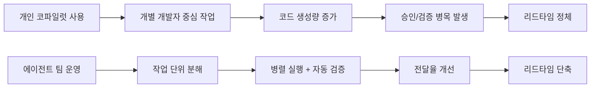

요약하면 이거다.  
이제 경쟁 포인트는 "모델 스펙" 자체보다 **팀이 AI를 붙여 실제로 일하는 방식**이다.

최근 발표된 Opus 4.6 관련 소식은 단순 업그레이드 뉴스가 아니라,
개발 조직의 워크플로를 다시 설계하라는 신호에 가깝다.

## 핵심 변화 한눈에 보기

| 구분 | 이전(개인 코파일럿 중심) | 현재(에이전트 팀 중심) |
|---|---|---|
| 작업 단위 | 개인이 큰 덩어리 작업 처리 | 작은 단위로 분해 후 병렬 실행 |
| 병목 | 코드 작성 속도 | 업무 분해/검증/승인 흐름 |
| 품질 관리 | 리뷰어 개인 역량 의존 | 체크리스트·게이트 기반 운영 |
| 성과 지표 | 생성량(줄 수, 산출량) | 전달율(리드타임, 재작업률, 배포 안정성) |

이 표 하나만으로도, 왜 "도구 업그레이드"가 "운영 방식 변경"으로 이어지는지 보인다.

### 워크플로 변화 다이어그램

## 실무에서 바로 바뀌는 포인트

### 1) 작업 분해 품질이 성능을 결정한다

에이전트를 여러 개 붙이면 빨라질 것 같지만,
작업 정의가 모호하면 오히려 충돌/중복/재작업이 늘어난다.

최소한 아래 3개는 고정해야 한다.

- 입력 조건
- 완료 조건(Definition of Done)
- 실패 시 롤백 조건

### 2) 지표를 바꾸지 않으면 착시가 생긴다

"코드가 빨리 나온다"와 "제품이 빨리 안정적으로 나온다"는 다르다.

그래서 지표는 아래로 바꾸는 게 맞다.

- PR 왕복 시간
- 승인 대기 시간
- 재작업률
- 장애 없는 배포 비율

### 3) 좋은 엔지니어의 정의가 달라진다

이제 강점은 단순 구현 속도만이 아니다.

- 실행 흐름 설계
- 검증 자동화
- 팀 단위 의사결정 단축

이 세 가지를 같이 끌어올리는 사람이 결과를 만든다.

## 내가 적용해보는 운영 프레임 (v1)

1. **Task Contract**: 작업 정의 템플릿 고정  
2. **Quality Gate**: 테스트/리뷰/배포 전 검증 자동화  
3. **Decision SLA**: 승인 지연 상한선 운영

## 결론

AI 코딩 시대의 차이는
"누가 더 큰 모델을 쓰느냐"보다,
**누가 더 빠르고 안정적인 실행 시스템을 만드느냐**에서 난다.

---

## 시각자료 계획

- 본문 포함 완료: `핵심 변화 한눈에 보기` 비교표(데이터형 요약 테이블)
- 다음 리비전에서 추가 예정:
  - 지표 트래킹 그래프(리드타임/재작업률/승인대기 시간)
  - `before vs after` 워크플로 다이어그램 1개

---

### 참고 링크
- Anthropic News: https://www.anthropic.com/news
- CNBC: https://www.cnbc.com/2026/02/05/anthropic-claude-opus-4-6-vibe-working.html
- TechCrunch: https://techcrunch.com/2026/02/05/anthropic-releases-opus-4-6-with-new-agent-teams/
