## What is ollacode?

**ollacode** is a lightweight, local AI coding assistant that runs entirely on your machine. Think of it as a personal "Claude Code" or "Aider" — but using **Ollama** with the `qwen3-coder:30b` model, and with the bonus of **Telegram integration** for remote access.

No cloud APIs. No subscription fees. Just your local GPU doing the work.

## Why Build This?

I've been impressed by tools like Claude Code and Aider, but I wanted something:

1. **Fully local** — My code stays on my machine
2. **Telegram-enabled** — Ask coding questions from my phone while away from my desk
3. **Lightweight** — No heavy IDE plugins, just a terminal command
4. **Customizable** — My own tools, my own rules

## Architecture

Here's how ollacode is structured:

```mermaid
graph TD
    CLI["🖥️ CLI - Rich\nStreaming + Approval UI"] --> Engine
    TG["📱 Telegram Bot\nPer-user Sessions"] --> Engine
    Engine["⚙️ Conversation Engine\nHistory | Tool Orchestration\nAgentic Loop | Project Memory"]
    Engine --> Ollama["🔗 Ollama Client\nhttpx async"]
    Engine --> Tools["🛠️ Tool System\n7 tools"]
    Engine --> Prompts["📋 System Prompt\n+ OLLACODE.md Memory"]
    Ollama --> Server["🧠 Ollama Server\nlocalhost:11434\nqwen3-coder:30b"]

    style CLI fill:#4a9eff,stroke:#2d7cd4,color:#fff
    style TG fill:#0088cc,stroke:#006699,color:#fff
    style Engine fill:#9b59b6,stroke:#7d3c98,color:#fff
    style Ollama fill:#e67e22,stroke:#d35400,color:#fff
    style Tools fill:#27ae60,stroke:#1e8449,color:#fff
    style Prompts fill:#f39c12,stroke:#d68910,color:#fff
    style Server fill:#2c3e50,stroke:#1a252f,color:#fff
```



The key design decision was separating the **Conversation Engine** from the interfaces. Both CLI and Telegram share the same engine, so all the smart logic (tool calling, agentic loops, project memory) works identically regardless of how you interact with it.

## What I Built on Day 1

### Core Foundation

I built the entire working system in a single session:

**7 Python modules**, ~1500 lines of code:

| Module | Purpose |
|--------|---------|
| `config.py` | Settings management via `.env` files |
| `ollama_client.py` | Async HTTP client for Ollama's `/api/chat` API |
| `engine.py` | Conversation engine with agentic loop |
| `tools.py` | 7 coding tools (file ops, search, command execution) |
| `prompts.py` | System prompt + project memory loader |
| `main.py` | CLI interface with Rich terminal UI |
| `telegram_bot.py` | Telegram bot with per-user sessions |

### The Tool System

This is where the magic happens. The AI doesn't just chat — it can *act*:

| Tool | What It Does |
|------|-------------|
| `read_file` | Read files with line numbers |
| `write_file` | Create new files |
| `edit_file` | **Diff-based** search/replace editing |
| `list_directory` | Browse directory contents |
| `search_files` | Find files by glob pattern |
| `grep_search` | Search inside file contents |
| `run_command` | Execute shell commands |

The `edit_file` tool is particularly important — inspired by Aider's approach, it uses **search/replace blocks** instead of rewriting entire files. This means:

- **Token efficiency**: Only the changed portion is sent
- **Safety**: No risk of accidentally wiping a file
- **Diff preview**: You see exactly what will change before it happens

### Agentic Loop

The conversation engine runs an **agentic loop** — up to 10 iterations of:

```mermaid
flowchart LR
    A["👤 User Request"] --> B["🤖 AI Response"]
    B --> C{"Tool Calls?"}
    C -- No --> D["✅ Return Response"]
    C -- Yes --> E["⚙️ Execute Tools"]
    E --> F["📊 Feed Results Back"]
    F --> G["🤖 AI Analyzes"]
    G --> H{"More Tools?"}
    H -- Yes --> E
    H -- No --> D

    style A fill:#3498db,stroke:#2980b9,color:#fff
    style B fill:#9b59b6,stroke:#7d3c98,color:#fff
    style D fill:#27ae60,stroke:#1e8449,color:#fff
    style E fill:#e67e22,stroke:#d35400,color:#fff
    style F fill:#f39c12,stroke:#d68910,color:#fff
    style G fill:#9b59b6,stroke:#7d3c98,color:#fff
```



If a tool returns an error, the engine automatically prompts the AI to analyze and fix the issue. This means the AI can:

1. Read a file
2. Edit it
3. Run tests
4. See test failures
5. Fix the code
6. Re-run tests
7. Report success

All in a single user request.

### Approval System

Inspired by Cline's human-in-the-loop approach, dangerous operations require user approval:

- **CLI**: Shows a diff preview + `y/n/a` prompt before file modifications or command execution
- **Telegram**: Auto-approves for convenience (since you're already remote)
- **`--auto-approve` flag**: Skip all prompts when you trust the AI

### Project Memory (OLLACODE.md)

Inspired by Claude Code's `CLAUDE.md`, drop an `OLLACODE.md` file in your workspace root:

```markdown
# Project Rules
- Python 3.12, type hints required
- Use pytest for testing
- Database: PostgreSQL with SQLAlchemy
```

This gets automatically injected into every conversation, so the AI always knows your project's conventions.

## Tech Stack

| Layer | Technology |
|-------|-----------|
| Language | Python 3.10+ |
| LLM Backend | Ollama (local) |
| Model | qwen3-coder:30b |
| HTTP Client | httpx (async) |
| CLI UI | Rich + prompt-toolkit |
| Telegram | python-telegram-bot |
| Config | python-dotenv |

## Quick Demo

**CLI Mode:**
```bash
$ ollacode cli
   ____  _ _         _____          _
  / __ \| | |       / ____|        | |
 | |  | | | | __ _ | |     ___   __| | ___
 | |  | | | |/ _` || |    / _ \ / _` |/ _ \
 | |__| | | | (_| || |___| (_) | (_| |  __/
  \____/|_|_|\__,_| \_____\___/ \__,_|\___|

ollacode ❯ Fix the bug in main.py
```

**Telegram Mode:**
```bash
$ ollacode telegram
🤖 ollacode Telegram 봇을 시작합니다...
   모델: qwen3-coder:30b
   서버: http://localhost:11434
```

Then just message your bot from Telegram — ask it to review code, write functions, debug errors, all from your phone.

## What's Next (Day 2+)

Based on my research of Claude Code, Aider, and Cline, here's what I'm planning:

- **Git integration** — Auto-commit with AI-generated messages
- **Context management** — Auto-summarize long conversations to save tokens
- **Codebase awareness** — Auto-detect project structure and frameworks
- **Plan mode** — Outline steps before execution
- **Plugin system** — User-defined custom tools

## Get It

```bash
git clone https://github.com/rockyRunner-ai/ollacode.git
cd ollacode
python3 -m venv .venv && source .venv/bin/activate
pip install -e .
cp .env.example .env
ollacode cli
```

Requires [Ollama](https://ollama.com) with `qwen3-coder:30b` pulled.

---

*This is Day 1 of the ollacode devlog. Follow along as I build a full-featured local AI coding assistant.*
