## The Problem: Tokens Are Precious

Running an AI coding assistant **locally** means your context window is limited. Models like `qwen3-coder:30b` have finite context sizes, and every token counts — unlike cloud APIs where you can throw context at GPT-4's 128K window.

After Day 1, I noticed that after a few tool-heavy interactions, the conversation history would balloon rapidly. A single `read_file` on a 500-line file would dump thousands of tokens into history, leaving little room for the actual conversation.

## What Changed on Day 2

I implemented **5 optimizations** to cut token usage dramatically:

```mermaid
graph LR
    A["🇰🇷 Korean Prompts<br/>~800-1000 tokens"] -->|"Translate"| B["🇺🇸 English Prompts<br/>~300 tokens"]
    C["📚 Unlimited History"] -->|"Compact"| D["📝 Auto-Summarized"]
    E["📄 500-line Reads"] -->|"Reduce"| F["📄 200-line Reads"]
    G["💾 Full Tool Results"] -->|"Compress"| H["📋 Truncated in History"]
    I["❓ No Token Tracking"] -->|"Add"| J["📊 Live Token Count"]

    style B fill:#27ae60,stroke:#1e8449,color:#fff
    style D fill:#27ae60,stroke:#1e8449,color:#fff
    style F fill:#27ae60,stroke:#1e8449,color:#fff
    style H fill:#27ae60,stroke:#1e8449,color:#fff
    style J fill:#27ae60,stroke:#1e8449,color:#fff
```



## 1. English System Prompt (Biggest Win)

This was the most impactful single change. Most LLM tokenizers are **English-centric** — Korean text uses 2-3× more tokens for the same meaning:

| Text | Korean | English |
|------|:------:|:-------:|
| "Display file contents with line numbers" | ~15-20 tokens | ~7-8 tokens |
| Full system prompt | **~800-1000** tokens | **~300** tokens |

By switching the system prompt to English, I saved **~60% of the base cost** that's included in every API call. The AI still responds in whatever language the user uses — if you ask in Korean, it answers in Korean.

```python
# Before (Korean — ~2000 chars, ~1000 tokens)
SYSTEM_PROMPT = """\
당신은 **ollacode**, 전문 코딩 어시스턴트입니다.
## 도구 사용법
1. **파일 읽기** — 파일 내용을 줄 번호와 함께 표시
...7 detailed tool descriptions in Korean...
"""

# After (English — ~1200 chars, ~300 tokens)  
SYSTEM_PROMPT = """\
You are **ollacode**, an expert coding assistant.
## Tools
Available tools:
- `read_file(path)` — Read file with line numbers
- `edit_file(path, search, replace)` — Partial edit via search/replace
...compact format...
"""
```

## 2. Context Compaction

The conversation engine now **auto-compresses** old messages when approaching the token limit:


The compaction strategy:
- **Always preserved**: System prompt + last 6 messages
- **Old messages**: Compressed to one-line summaries
- **Tool results**: Replaced with `[tool results processed]`

This happens transparently — the user doesn't notice, but the context stays manageable.

## 3. Tool Output Limits

Big files and verbose commands were the main token hogs:

| Setting | Before | After | Savings |
|---------|:------:|:-----:|:-------:|
| `read_file` max lines | 500 | 200 | 60% |
| `run_command` stdout | 3000 chars | 1500 chars | 50% |
| `run_command` stderr | 1500 chars | 800 chars | 47% |
| `grep_search` results | 50 matches | 20 matches | 60% |
| Diff preview | 2000 chars | 1000 chars | 50% |

I also added `start_line` and `end_line` parameters to `read_file`, so the AI can request just the lines it needs:

```json
{"tool": "read_file", "path": "src/main.py", "start_line": 50, "end_line": 80}
```

## 4. History Result Compression

Tool results in the conversation history get **automatically compressed** when they exceed 800 characters. Instead of storing the entire output of a `read_file` call, the engine stores:

```
[read_file result — 4523 chars, compressed]
📄 **large_file.py** (342 lines, showing L1-200)
   1 | import os
   2 | import sys
... (truncated) ...
...last 200 chars preserved...
```

This means the AI still sees enough context to work with, but the history doesn't bloat.

## 5. Token Tracking

A new token estimation system lets you monitor usage:

```
ollacode ❯ /model
Model: qwen3-coder:30b
Server: http://localhost:11434
Messages: 12
Est. tokens: 2847 / 8192
Compact mode: True
```

The estimation is heuristic-based (no tokenizer dependency needed):
- English: ~4 characters per token
- CJK (Korean/Chinese/Japanese): ~1.5 characters per token

## Configuration

Two new environment variables in `.env`:

```bash
# Trigger context compaction at 80% of this value
MAX_CONTEXT_TOKENS=8192

# Enable/disable automatic compression
COMPACT_MODE=true
```

Set `MAX_CONTEXT_TOKENS` based on your model's actual context size and available VRAM:
- `4096` — Aggressive compression (low VRAM)
- `8192` — Balanced (default)
- `16384+` — Relaxed (plenty of VRAM)

## Impact

| Metric | Before | After | Change |
|--------|:------:|:-----:|:------:|
| System prompt tokens | ~800-1000 | **299** | **-65%** |
| 10-turn conversation (with tools) | ~15K+ tokens | **~5-7K** tokens | **-50-60%** |
| Max file read (tokens) | ~3000 | **~1200** | **-60%** |

The result: **longer, more productive sessions** before hitting context limits, and **faster responses** because the model processes fewer tokens per request.

## What's Next

- **Git integration** — Auto-commit with AI-generated messages
- **Codebase awareness** — Auto-detect project structure
- **Streaming context** — Show compaction events in real-time

---

*Day 2 of the ollacode devlog. Memory optimization makes local LLMs actually practical for real coding sessions.*
