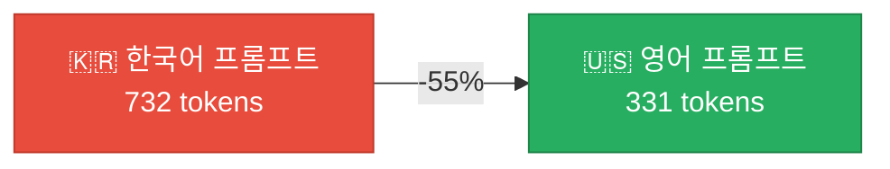

## 배경

[이전 포스트](/posts/ollacode-day2-memory-optimization/)에서 ollacode의 메모리 최적화를 진행하면서, 시스템 프롬프트를 한국어에서 영어로 전환했습니다. 이론적으로 LLM 토크나이저는 영어에 최적화되어 있어 같은 의미를 더 적은 토큰으로 표현할 수 있습니다.

하지만 **"이론적으로"만으로는 부족합니다.** 직접 [ollama-bench](https://github.com/rockyRunner-ai/ollama-bench)를 만들어 **실측 데이터**로 검증했습니다.

## 실험 설정

| 항목 | 값 |
|------|-----|
| 모델 | `qwen3-coder:30b` |
| 하드웨어 | Mac Mini (Apple Silicon) |
| 벤치마크 모드 | context-growth (5 rounds) |
| Seed | 42 |
| Temperature | 0.0 |
| 워크로드 | 동일한 20개 코딩 프롬프트 시퀀스 |

**비교 대상**:
- **Before (Korean)**: 한국어 시스템 프롬프트 (~2000 chars, 732 input tokens)
- **After (English)**: 영어 시스템 프롬프트 (~1200 chars, 331 input tokens)

## 결과

### 라운드별 상세 데이터

#### 한국어 시스템 프롬프트

| Round | In Tok | Out Tok | Gen t/s | Prefill t/s | TTFT(ms) | Total(ms) | Mem(MB) |
|:-----:|:------:|:-------:|:-------:|:-----------:|:--------:|:---------:|:-------:|
| 1 | 732 | 296 | 36.4 | 317.4 | 2,307 | 25,103 | 19,335 |
| 2 | 1,057 | 591 | 34.6 | 2,181.7 | 484 | 17,806 | 19,333 |
| 3 | 1,683 | 865 | 32.8 | 2,218.2 | 759 | 27,439 | 19,338 |
| 4 | 2,578 | 1,150 | 31.2 | 3,012.6 | 856 | 38,083 | 19,345 |
| 5 | 3,754 | 1,365 | 28.9 | 2,831.7 | 1,326 | 48,870 | 19,343 |

#### 영어 시스템 프롬프트

| Round | In Tok | Out Tok | Gen t/s | Prefill t/s | TTFT(ms) | Total(ms) | Mem(MB) |
|:-----:|:------:|:-------:|:-------:|:-----------:|:--------:|:---------:|:-------:|
| 1 | 331 | 232 | 38.2 | 339.6 | 975 | 7,211 | 19,356 |
| 2 | 591 | 527 | 36.9 | 1,934.2 | 306 | 14,748 | 19,357 |
| 3 | 1,152 | 923 | 35.1 | 3,266.7 | 353 | 26,937 | 19,358 |
| 4 | 2,104 | 624 | 32.6 | 6,098.8 | 345 | 19,672 | 19,356 |
| 5 | 2,753 | 1,071 | 27.3 | 8,401.2 | 328 | 40,304 | 19,289 |

### 비교 요약

| Metric | Korean | English | 변화 |
|--------|:------:|:-------:|:----:|
| **Avg Gen Speed** | 32.8 t/s | 34.0 t/s | **+3.8%** ✅ |
| **Avg TTFT** | 1,146 ms | 461 ms | **-59.8%** ✅ |
| **Avg Prefill Speed** | 2,112 t/s | 4,008 t/s | **+89.8%** ✅ |
| **Round 1 Input Tokens** | 732 | 331 | **-54.8%** ✅ |
| **Peak Memory** | 19,345 MB | 19,358 MB | +0.1% (무시) |

## 분석

### 1. 입력 토큰 55% 절약

가장 근본적인 차이입니다. 같은 내용의 시스템 프롬프트가 한국어로는 **732 토큰**, 영어로는 **331 토큰**을 사용합니다.



**왜 이런 차이가 나는가?** LLM의 토크나이저(예: BPE)는 영어 텍스트에 최적화되어 있습니다. 영어 단어 하나가 보통 1~2토큰인 반면, 한국어 음절은 각각 별도의 토큰으로 인코딩되는 경우가 많습니다:

- `"function"` → 1 token
- `"함수"` → 2~3 tokens (같은 의미)

### 2. TTFT 60% 개선 — 체감 반응성

TTFT(Time To First Token)가 평균 **1,146ms → 461ms**로 60% 개선되었습니다.

이것은 사용자가 **입력 후 첫 글자가 나타날 때까지의 대기 시간**입니다. 1.1초 기다리던 것이 0.5초로 줄었습니다. 체감 반응성에 가장 큰 영향을 미치는 메트릭이며, 입력 토큰 수에 직접적으로 비례합니다.

### 3. Prefill 속도 90% 향상

Prefill 속도가 **2,112 → 4,008 t/s**로 거의 **2배** 향상되었습니다.

**핵심 인사이트**: Round 4-5에서 영어 프롬프트의 Prefill이 **6,000~8,400 t/s**에 달합니다. 이는 입력이 커질수록 GPU의 행렬 연산 병렬화가 더 효율적으로 동작하기 때문입니다. 한국어는 토큰 수가 많아서 이 효율이 상대적으로 낮습니다.

### 4. Generation 속도 — 소폭 개선

Gen 속도는 **32.8 → 34.0 t/s** (+3.8%)로 소폭 개선되었습니다.

생성 속도는 입력 크기보다 **모델 아키텍처와 하드웨어**에 더 의존하기 때문에 큰 차이가 나지 않습니다. 다만 KV 캐시가 작을수록 캐시 히트 효율이 올라가므로 약간의 개선이 있습니다.

### 5. 메모리 — 변화 없음

메모리 사용량은 ~19.3GB로 동일합니다. 시스템 프롬프트 크기 차이(~400 토큰)는 30B 모델의 파라미터 메모리에 비하면 무시할 수준입니다.

## 핵심 교훈


> **로컬 LLM의 내부 프롬프트는 반드시 영어로 작성하세요.**
> 사용자 언어와 무관하게 시스템 프롬프트, 도구 설명, 내부 메시지를 영어로 하면 토큰 효율이 크게 향상됩니다. AI는 사용자가 한국어로 대화하면 한국어로 응답하므로 사용자 경험에는 영향이 없습니다.

## 도구

이 벤치마크는 [ollama-bench](https://github.com/rockyRunner-ai/ollama-bench)로 실행했습니다:

```bash
# 한국어 프롬프트 벤치마크
ollama-bench --model qwen3-coder:30b --rounds 5 \
  --system-prompt korean_prompt.txt \
  --system-prompt-label korean \
  --output bench_korean.json

# 영어 프롬프트 벤치마크
ollama-bench --model qwen3-coder:30b --rounds 5 \
  --system-prompt english_prompt.txt \
  --system-prompt-label english \
  --output bench_english.json

# 비교
ollama-bench --compare bench_korean.json bench_english.json
```

---

*ollacode 프로젝트의 성능 최적화 결과. 벤치마크 도구와 데이터 기반의 의사결정이 최적화의 핵심입니다.*
