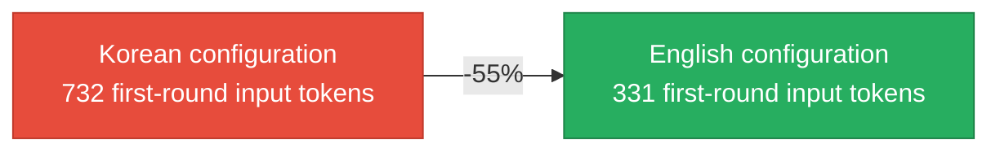
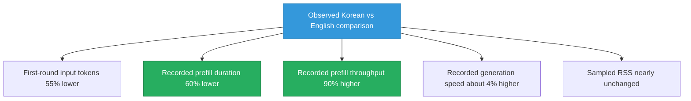

**Correction — September 13, 2026:** The original TTFT columns use Ollama's `prompt_eval_duration`; they are now labeled prefill duration. The reported memory values are samples, not continuous peaks. The table is retained as a historical comparison, with causal claims narrowed to what it measures.

## Background

In the [previous post](/posts/ollacode-day2-memory-optimization/), I tried reducing ollacode's prompt token usage by rewriting its system prompt in English. Token usage depends on the tokenizer and the exact wording. The English rewrite used fewer first-round input tokens in this comparison; that does not establish a universal advantage for English prompts.

But **theory alone isn't enough.** I built [ollama-bench](https://github.com/rockyRunnr/ollama-bench) and measured the difference with **real data**.

## Experiment Setup

| Parameter | Value |
|-----------|-------|
| Model | `qwen3-coder:30b` |
| Hardware | Mac Mini (Apple Silicon) |
| Benchmark mode | context-growth (5 rounds) |
| Seed | 42 |
| Temperature | 0.0 |
| Workload | Same 20-prompt coding sequence |

**What we're comparing**:
- **Before (Korean)**: Korean system prompt (~2000 chars, 732 input tokens)
- **After (English)**: English system prompt (~1200 chars, 331 input tokens)

## Results

### Per-Round Data

#### Korean System Prompt

| Round | In Tok | Out Tok | Gen t/s | Prefill t/s | Prefill(ms) | Total(ms) | Mem(MB) |
|:-----:|:------:|:-------:|:-------:|:-----------:|:--------:|:---------:|:-------:|
| 1 | 732 | 296 | 36.4 | 317.4 | 2,307 | 25,103 | 19,335 |
| 2 | 1,057 | 591 | 34.6 | 2,181.7 | 484 | 17,806 | 19,333 |
| 3 | 1,683 | 865 | 32.8 | 2,218.2 | 759 | 27,439 | 19,338 |
| 4 | 2,578 | 1,150 | 31.2 | 3,012.6 | 856 | 38,083 | 19,345 |
| 5 | 3,754 | 1,365 | 28.9 | 2,831.7 | 1,326 | 48,870 | 19,343 |

#### English System Prompt

| Round | In Tok | Out Tok | Gen t/s | Prefill t/s | Prefill(ms) | Total(ms) | Mem(MB) |
|:-----:|:------:|:-------:|:-------:|:-----------:|:--------:|:---------:|:-------:|
| 1 | 331 | 232 | 38.2 | 339.6 | 975 | 7,211 | 19,356 |
| 2 | 591 | 527 | 36.9 | 1,934.2 | 306 | 14,748 | 19,357 |
| 3 | 1,152 | 923 | 35.1 | 3,266.7 | 353 | 26,937 | 19,358 |
| 4 | 2,104 | 624 | 32.6 | 6,098.8 | 345 | 19,672 | 19,356 |
| 5 | 2,753 | 1,071 | 27.3 | 8,401.2 | 328 | 40,304 | 19,289 |

### Summary Comparison

| Metric | Korean | English | Change |
|--------|:------:|:-------:|:------:|
| **Avg Gen Speed** | 32.8 t/s | 34.0 t/s | **+3.8%** ✅ |
| **Avg Prefill Duration** | 1,146 ms | 461 ms | **-59.8%** ✅ |
| **Avg Prefill Speed** | 2,112 t/s | 4,008 t/s | **+89.8%** ✅ |
| **Round 1 Input Tokens** | 732 | 331 | **-54.8%** ✅ |
| **Max Sampled RSS** | 19,345 MB | 19,358 MB | +0.1% (negligible) |

## Analysis

### 1. 55% Fewer First-Round Input Tokens

The first round reports **732 input tokens** for the Korean configuration and **331** for the English configuration, a 54.8% reduction. These are request-level input counts, not a separately measured tokenizer count of the system prompt alone. Later rounds include generated conversation history, which also differs between runs.


```mermaid
graph LR
    A["Korean configuration<br/>732 first-round input tokens"] -->|"-55%"| B["English configuration<br/>331 first-round input tokens"]

    style A fill:#e74c3c,stroke:#c0392b,color:#fff
    style B fill:#27ae60,stroke:#1e8449,color:#fff
```

The rewrite changed both language and wording/length. Tokenization can contribute to the difference, but the table does not isolate language as the only cause or validate identical instruction-following quality.

### 2. Recorded Prefill Duration Fell by About 60%

Average reported prompt evaluation duration fell from **1,146 ms to 461 ms**. The benchmark stored this in `ttft_ms`, but it did not stream responses or measure the first token's arrival. It therefore supports a reduction in this server-side phase, not a measured 60% reduction in client TTFT. [Metric definition and limitation](/posts/ollama-bench-tool/#3-prefill-duration-historically-labeled-ttft)

### 3. Prefill Speed Doubled (+90%)

Prefill speed jumped from **2,112 → 4,008 t/s** — nearly **2×** faster.

Rounds 4–5 report **6,000–8,400 t/s** in the English configuration. The table alone does not identify the cause: processed-token counts, prefix reuse, warm-up, and differing conversation histories need to be controlled before attributing this to GPU efficiency or prompt language.

### 4. Generation Speed — Modest Improvement

Gen speed improved from **32.8 → 34.0 t/s** (+3.8%).

This is a small observed difference in a five-round comparison. Context length, differing outputs, and run variability can affect it. No cache-hit counters or repeated-run uncertainty estimates were recorded here, so a cache-efficiency explanation is unverified.

### 5. Memory — No Change

Sampled RSS stayed near the original table's 19.3GB scale. Fixed KV preallocation and the large weight footprint can hide differences in used token slots; this observation does not show that token count has no effect on KV requirements.

## Key Takeaway


```mermaid
flowchart TD
    A["Observed Korean vs English comparison"] --> B["First-round input tokens 55% lower"]
    A --> C["Recorded prefill duration 60% lower"]
    A --> D["Recorded prefill throughput 90% higher"]
    A --> E["Recorded generation speed about 4% higher"]
    A --> F["Sampled RSS nearly unchanged"]

    style A fill:#3498db,stroke:#2980b9,color:#fff
    style C fill:#27ae60,stroke:#1e8449,color:#fff
    style D fill:#27ae60,stroke:#1e8449,color:#fff
```

> The English rewrite reduced input tokens and recorded prefill duration in this configuration. Compare token count, instruction-following quality, output language, and end-to-end latency for the actual model and workload before adopting the same change elsewhere.

## Tools Used

This benchmark was run with [ollama-bench](https://github.com/rockyRunnr/ollama-bench):

```bash
# Korean prompt benchmark
ollama-bench --model qwen3-coder:30b --rounds 5 \
  --system-prompt korean_prompt.txt \
  --system-prompt-label korean \
  --output bench_korean.json

# English prompt benchmark
ollama-bench --model qwen3-coder:30b --rounds 5 \
  --system-prompt english_prompt.txt \
  --system-prompt-label english \
  --output bench_english.json

# Compare
ollama-bench --compare bench_korean.json bench_english.json
```

---

*ollacode optimization results. Data-driven decisions are the foundation of meaningful optimization.*
