## Background

In the [previous post](/posts/ollacode-day2-memory-optimization/), I optimized ollacode's memory usage by switching the system prompt from Korean to English. The theory is simple: LLM tokenizers are optimized for English, so the same meaning requires fewer tokens.

But **theory alone isn't enough.** I built [ollama-bench](https://github.com/rockyRunnr/ollama-bench) and measured the difference with **real data**.

## Experiment Setup

| Parameter | Value |
|-----------|-------|
| Model | `qwen3-coder:30b` |
| Hardware | Mac Mini (Apple Silicon) |
| Benchmark mode | context-growth (5 rounds) |
| Seed | 42 |
| Temperature | 0.0 |
| Workload | Same 20-prompt coding sequence |

**What we're comparing**:
- **Before (Korean)**: Korean system prompt (~2000 chars, 732 input tokens)
- **After (English)**: English system prompt (~1200 chars, 331 input tokens)

## Results

### Per-Round Data

#### Korean System Prompt

| Round | In Tok | Out Tok | Gen t/s | Prefill t/s | TTFT(ms) | Total(ms) | Mem(MB) |
|:-----:|:------:|:-------:|:-------:|:-----------:|:--------:|:---------:|:-------:|
| 1 | 732 | 296 | 36.4 | 317.4 | 2,307 | 25,103 | 19,335 |
| 2 | 1,057 | 591 | 34.6 | 2,181.7 | 484 | 17,806 | 19,333 |
| 3 | 1,683 | 865 | 32.8 | 2,218.2 | 759 | 27,439 | 19,338 |
| 4 | 2,578 | 1,150 | 31.2 | 3,012.6 | 856 | 38,083 | 19,345 |
| 5 | 3,754 | 1,365 | 28.9 | 2,831.7 | 1,326 | 48,870 | 19,343 |

#### English System Prompt

| Round | In Tok | Out Tok | Gen t/s | Prefill t/s | TTFT(ms) | Total(ms) | Mem(MB) |
|:-----:|:------:|:-------:|:-------:|:-----------:|:--------:|:---------:|:-------:|
| 1 | 331 | 232 | 38.2 | 339.6 | 975 | 7,211 | 19,356 |
| 2 | 591 | 527 | 36.9 | 1,934.2 | 306 | 14,748 | 19,357 |
| 3 | 1,152 | 923 | 35.1 | 3,266.7 | 353 | 26,937 | 19,358 |
| 4 | 2,104 | 624 | 32.6 | 6,098.8 | 345 | 19,672 | 19,356 |
| 5 | 2,753 | 1,071 | 27.3 | 8,401.2 | 328 | 40,304 | 19,289 |

### Summary Comparison

| Metric | Korean | English | Change |
|--------|:------:|:-------:|:------:|
| **Avg Gen Speed** | 32.8 t/s | 34.0 t/s | **+3.8%** ✅ |
| **Avg TTFT** | 1,146 ms | 461 ms | **-59.8%** ✅ |
| **Avg Prefill Speed** | 2,112 t/s | 4,008 t/s | **+89.8%** ✅ |
| **Round 1 Input Tokens** | 732 | 331 | **-54.8%** ✅ |
| **Peak Memory** | 19,345 MB | 19,358 MB | +0.1% (negligible) |

## Analysis

### 1. 55% Fewer Input Tokens — The Root Cause

This is the most fundamental difference. The same system prompt content uses **732 tokens** in Korean but only **331 tokens** in English.

```mermaid
graph LR
    A["🇰🇷 Korean Prompt<br/>732 tokens"] -->|"-55%"| B["🇺🇸 English Prompt<br/>331 tokens"]

    style A fill:#e74c3c,stroke:#c0392b,color:#fff
    style B fill:#27ae60,stroke:#1e8449,color:#fff
```



**Why such a big difference?** LLM tokenizers (e.g., BPE) are optimized for English text. An English word typically maps to 1–2 tokens, while Korean syllables often require separate tokens each:

- `"function"` → 1 token
- `"함수"` (same meaning) → 2–3 tokens

### 2. TTFT Improved by 60% — Perceived Responsiveness

Average TTFT dropped from **1,146ms → 461ms** — a 60% improvement.

This is the **wait time before the first character appears**. Going from 1.1 seconds to 0.5 seconds is a substantial UX improvement. TTFT is directly proportional to input token count, so fewer input tokens = faster first response.

### 3. Prefill Speed Doubled (+90%)

Prefill speed jumped from **2,112 → 4,008 t/s** — nearly **2×** faster.

**Key insight**: In Rounds 4–5, the English prompt achieves **6,000–8,400 t/s** prefill. As input grows larger, GPU matrix operation parallelization becomes more efficient. Korean's higher token count reduces this efficiency since there are more tokens to process for the same semantic content.

### 4. Generation Speed — Modest Improvement

Gen speed improved from **32.8 → 34.0 t/s** (+3.8%).

Generation speed depends more on **model architecture and hardware** than input size, so the difference is small. However, a smaller KV cache (from fewer input tokens) improves cache hit efficiency slightly.

### 5. Memory — No Change

Memory usage stayed at ~19.3GB. The prompt size difference (~400 tokens) is negligible compared to the 30B model's parameter memory footprint.

## Key Takeaway

```mermaid
flowchart TD
    A["System Prompt<br/>Korean → English"] --> B["Input Tokens 55% ↓"]
    B --> C["TTFT 60% ↓<br/>(Responsiveness ↑)"]
    B --> D["Prefill 90% ↑<br/>(Processing speed ↑)"]
    B --> E["Gen Speed 4% ↑<br/>(Modest gain)"]
    B --> F["Memory: No change"]

    style A fill:#3498db,stroke:#2980b9,color:#fff
    style C fill:#27ae60,stroke:#1e8449,color:#fff
    style D fill:#27ae60,stroke:#1e8449,color:#fff
```



> **Always write internal prompts in English for local LLMs.**
> Regardless of the user's language, keep system prompts, tool descriptions, and internal messages in English for better token efficiency. The AI will still respond in whatever language the user writes in, so the user experience is unaffected.

## Tools Used

This benchmark was run with [ollama-bench](https://github.com/rockyRunnr/ollama-bench):

```bash
# Korean prompt benchmark
ollama-bench --model qwen3-coder:30b --rounds 5 \
  --system-prompt korean_prompt.txt \
  --system-prompt-label korean \
  --output bench_korean.json

# English prompt benchmark
ollama-bench --model qwen3-coder:30b --rounds 5 \
  --system-prompt english_prompt.txt \
  --system-prompt-label english \
  --output bench_english.json

# Compare
ollama-bench --compare bench_korean.json bench_english.json
```

---

*ollacode optimization results. Data-driven decisions are the foundation of meaningful optimization.*
