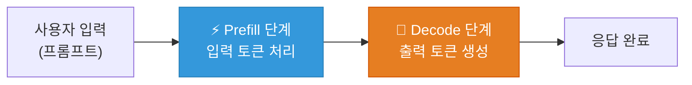
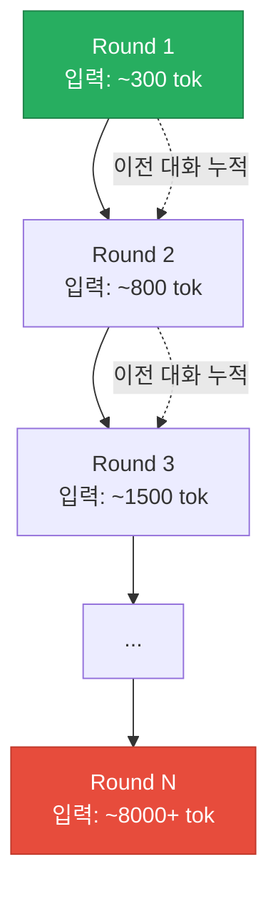

## 왜 벤치마크 도구가 필요한가?

Ollama로 로컬 LLM을 돌리다 보면 자연스럽게 궁금해지는 것들이 있습니다:

- 대화가 길어지면 **얼마나 느려지는가?**
- 시스템 프롬프트를 바꾸면 **실제로 빨라지는가?**
- 모델 파라미터를 조절하면 **체감되는 차이가 있는가?**

이런 질문에 답하려면 **재현 가능한 워크로드**로 **일관된 측정**을 해야 합니다. 그래서 [ollama-bench](https://github.com/rockyRunner-ai/ollama-bench)를 만들었습니다.

## 측정하는 메트릭

ollama-bench는 Ollama API가 응답에 포함하는 내부 메트릭을 활용합니다. 각각이 무엇을 의미하는지 자세히 설명하겠습니다.

### 1. Generation Speed (Gen t/s) — 토큰 생성 속도

```
Gen t/s = eval_count / eval_duration × 10⁹
```

**의미**: 모델이 출력 토큰을 **생성하는 속도**입니다. `eval_count`는 생성된 출력 토큰 수, `eval_duration`은 생성에 걸린 시간(나노초)입니다.

**왜 중요한가**: 이 수치가 사용자가 체감하는 "타이핑 속도"입니다. 30 t/s면 초당 약 30개 토큰이 화면에 나타나며, 10 t/s 이하로 떨어지면 체감상 매우 느려집니다.

**영향 요소**:
- GPU VRAM과 메모리 대역폭
- 모델 크기 (파라미터가 클수록 느림)
- 양자화 수준 (Q4가 Q8보다 빠름)
- **입력 컨텍스트 크기와는 독립적** — 생성 단계에서는 KV 캐시 히트 효율에 따라 달라짐

### 2. Prefill Speed (Prefill t/s) — 프리필 속도

```
Prefill t/s = prompt_eval_count / prompt_eval_duration × 10⁹
```

**의미**: 모델이 입력 프롬프트를 **처리하는 속도**입니다. LLM의 응답 과정은 두 단계로 나뉩니다:



1. **Prefill**: 전체 입력을 한 번에 처리하여 KV 캐시 구축
2. **Decode**: KV 캐시를 기반으로 토큰을 하나씩 생성

Prefill은 행렬 곱셈이 주를 이루므로 GPU 병렬 처리에 유리합니다. 그래서 보통 Gen 속도보다 **훨씬 빠릅니다** (수천 t/s vs 수십 t/s).

**왜 중요한가**: 입력이 길어질수록 prefill 시간이 증가합니다. 컨텍스트가 8000 토큰이면 prefill에만 수 초가 걸릴 수 있습니다.

### 3. TTFT (Time To First Token) — 첫 토큰 응답 시간

```
TTFT = prompt_eval_duration (나노초 → 밀리초 변환)
```

**의미**: 사용자가 입력을 보낸 후 **첫 번째 출력 토큰이 나올 때까지의 시간**입니다. 실질적으로 Prefill 시간과 같습니다.

**왜 중요한가**: 이것이 사용자가 "대기"하는 시간입니다. TTFT가 3초면 3초 동안 아무 것도 안 나타나다가 갑자기 출력이 시작됩니다. 체감 반응성에 **가장 큰 영향**을 미치는 메트릭입니다.

**실전 기준**:
- < 500ms: 즉각적으로 느껴짐
- 500ms ~ 2s: 허용 가능
- > 3s: 느리게 느껴짐

### 4. Total Duration — 전체 응답 시간

```
Total = total_duration (나노초 → 밀리초 변환)
```

**의미**: 요청 시작부터 완료까지 전체 시간. Model loading + Prefill + Decode 전부 포함합니다.

### 5. Memory (MB) — 메모리 사용량

```
Memory = sum(RSS of all ollama processes) / 1024²
```

**의미**: 시스템의 모든 Ollama 관련 프로세스가 사용하는 **물리적 메모리(RSS)**입니다. `psutil`로 측정합니다.

**왜 중요한가**: Mac의 Unified Memory나 GPU VRAM은 유한합니다. 모델이 메모리를 점점 더 사용하면 스왑이 발생하고 성능이 급락합니다.

## 벤치마크 모드

### Context Growth (기본)



실제 대화처럼 히스토리가 쌓이면서 입력 토큰이 증가합니다. **"대화가 길어지면 얼마나 느려지는가?"**에 대한 답을 줍니다.

### Sustained Load

매 라운드마다 독립적인 요청 (히스토리 리셋). 입력 크기는 일정하고, **"장시간 사용하면 Ollama 프로세스 자체가 느려지는가?"**를 측정합니다.

## 재현 가능한 워크로드

벤치마크에서 가장 중요한 것은 **재현성**입니다:

1. **고정된 프롬프트 시퀀스**: 20개의 코딩 관련 프롬프트가 하드코딩되어 있어 매번 동일한 입력
2. **`seed: 42` + `temperature: 0`**: 동일한 입력에 대해 동일한 출력 보장
3. **JSON 저장**: 결과를 파일로 저장하여 나중에 비교 가능

```bash
# 최적화 전 측정
ollama-bench --model my-model --rounds 10 --output before.json

# ... 최적화 작업 ...

# 최적화 후 측정
ollama-bench --model my-model --rounds 10 --output after.json

# 비교
ollama-bench --compare before.json after.json
```

## 설치 및 사용법

```bash
git clone https://github.com/rockyRunner-ai/ollama-bench
cd ollama-bench
pip install -e .

# 바로 실행
ollama-bench --model qwen3-coder:30b --rounds 10
```

커스텀 워크로드도 지원합니다:

```json
{
  "prompts": [
    "First task...",
    "Second task...",
    "Third task..."
  ]
}
```

```bash
ollama-bench --workload my_prompts.json --model llama3.1:8b
```

## GitHub

- [rockyRunner-ai/ollama-bench](https://github.com/rockyRunner-ai/ollama-bench)

---

*다음 포스트에서는 이 도구를 사용하여 ollacode의 시스템 프롬프트 최적화 전후 성능을 비교한 결과를 공유합니다.*
