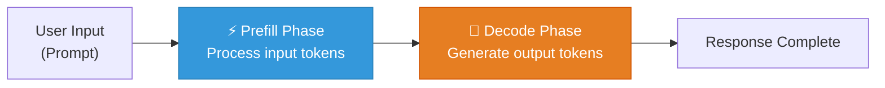
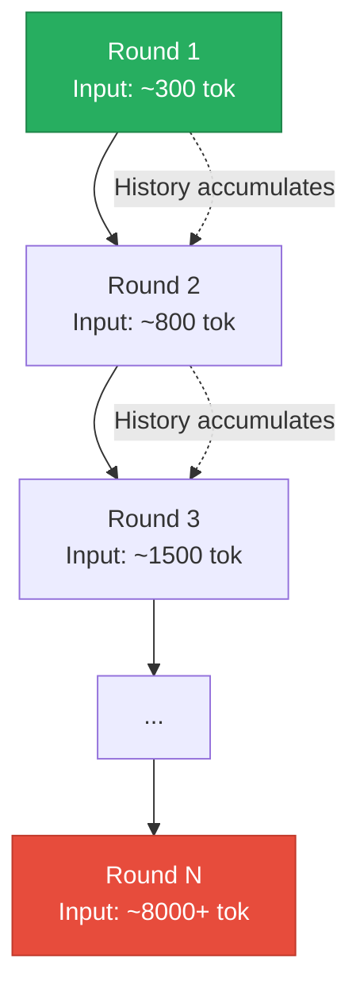

**Correction — September 13, 2026:** The original tool labels `prompt_eval_duration` as TTFT. That field is prefill duration, not measured time to the first streamed token. The memory samples also do not measure continuous peak usage. This post now uses the metric names supported by the implementation; the historical code/JSON field names remain unchanged.

## Why Build a Benchmark Tool?

When running local LLMs with Ollama, some questions naturally arise:

- How much **slower** does it get as conversations grow longer?
- Does changing the system prompt **actually** make it faster?
- Do parameter tweaks produce **measurable** differences?

Answering these requires **reproducible workloads** with **consistent measurements**. That's why I built [ollama-bench](https://github.com/rockyRunnr/ollama-bench).

## Metrics Explained

ollama-bench leverages the internal metrics that Ollama includes in every API response. Here's what each one means in detail.

### 1. Generation Speed (Gen t/s)

```
Gen t/s = eval_count / eval_duration × 10⁹
```

**What it measures**: The speed at which the model **generates output tokens**. `eval_count` is the number of output tokens produced, and `eval_duration` is the time spent generating them (in nanoseconds).

**Why it matters**: This is the "typing speed" users perceive. At 30 t/s, roughly 30 tokens appear per second on screen. Below 10 t/s, it feels noticeably sluggish.

**What affects it**:
- GPU VRAM and memory bandwidth
- Model size (more parameters = slower)
- Quantization type and the backend kernels that implement it
- Context length: each full-attention decode step reads more cached K/V as the sequence grows, even though past K/V projections are reused

### 2. Prefill Speed (Prefill t/s)

```
Prefill t/s = prompt_eval_count / prompt_eval_duration × 10⁹
```

**What it measures**: The speed at which the model **processes the input prompt**. LLM response generation happens in two distinct phases:


```mermaid
flowchart LR
    A["User Input<br/>(Prompt)"] --> B["⚡ Prefill Phase<br/>Process input tokens"]
    B --> C["💬 Decode Phase<br/>Generate output tokens"]
    C --> D["Response Complete"]

    style B fill:#3498db,stroke:#2980b9,color:#fff
    style C fill:#e67e22,stroke:#d35400,color:#fff
```

1. **Prefill**: Process the entire input at once to build the KV cache
2. **Decode**: Generate tokens one by one using the KV cache

Prefill is dominated by matrix multiplications, which benefit from GPU parallelism. That's why prefill is typically **much faster** than generation (thousands of t/s vs. tens of t/s).

**Why it matters**: Longer inputs generally increase prefill work. Scaling depends on attention, batching, prefix reuse, and the model; full-attention prefill includes a quadratic term in sequence length, so time is not universally proportional to token count.

### 3. Prefill Duration (Historically Labeled TTFT)

```text
prefill_ms = prompt_eval_duration / 10⁶
```

The implementation stores this in `ttft_ms`, but it measures the server-reported prompt evaluation duration. Requests use `stream: false`; the tool does not timestamp the first generated token arriving at the client.

True client-observed TTFT also includes queuing, request/network overhead, any required loading, and the first decode step. Measuring it requires streaming and timing the first non-empty output token. The historical `ttft_ms` values should be interpreted as **prefill duration**, not an end-to-end responsiveness measurement. [Measurement code](https://github.com/rockyRunnr/ollama-bench/blob/main/ollama_bench/core.py)

### 4. Total Duration

```
Total = total_duration (nanoseconds → milliseconds)
```

**What it measures**: Ollama's server-reported total request duration, including phases such as loading, prefill, and decode. The code also measures client wall time separately; server duration is not the same as full client/network end-to-end latency.

### 5. Memory (MB)

```
Memory = sum(RSS of all ollama processes) / 1024²
```

**What it measures**: The sum of RSS reported by `psutil` for matching Ollama-related processes. Division by 1024² yields MiB, although the original output labels it MB. Multiple process RSS values may count shared pages more than once. The code takes samples around requests; the maximum of those samples is not a continuously measured peak or an independent GPU allocation measurement.

**Why it matters**: Memory pressure can lead to reclaim, compression, paging, or allocation failure depending on the platform and resource. RSS alone cannot identify which mechanism occurred.

## Benchmark Modes

### Context Growth (Default)


```mermaid
flowchart TD
    R1["Round 1<br/>Input: ~300 tok"] --> R2["Round 2<br/>Input: ~800 tok"]
    R2 --> R3["Round 3<br/>Input: ~1500 tok"]
    R3 --> R4["..."]
    R4 --> RN["Round N<br/>Input: ~8000+ tok"]

    R1 -.->|"History accumulates"| R2
    R2 -.->|"History accumulates"| R3

    style R1 fill:#27ae60,stroke:#1e8449,color:#fff
    style RN fill:#e74c3c,stroke:#c0392b,color:#fff
```

History accumulates across rounds, growing input tokens each time — just like real conversations. Answers: **"How much slower does it get as context grows?"**

### Sustained Load

Each round is independent (history reset). Input size stays constant. Answers: **"Does the Ollama process itself degrade over extended use?"**

## Reproducible Workloads

Reproducibility is the most important property of a benchmark:

1. **Fixed prompt sequence**: 20 hardcoded coding prompts ensure identical input every run
2. **`seed: 42` + `temperature: 0`**: Reduces sampling variability; identical output is not guaranteed across different versions, backends, or execution conditions
3. **JSON export**: Save results to file for later comparison

```bash
# Measure before optimization
ollama-bench --model my-model --rounds 10 --output before.json

# ... apply optimizations ...

# Measure after optimization
ollama-bench --model my-model --rounds 10 --output after.json

# Compare
ollama-bench --compare before.json after.json
```

## Installation

```bash
git clone https://github.com/rockyRunnr/ollama-bench
cd ollama-bench
pip install -e .

# Run immediately
ollama-bench --model qwen3-coder:30b --rounds 10
```

Custom workloads are also supported:

```json
{
  "prompts": [
    "First task...",
    "Second task...",
    "Third task..."
  ]
}
```

```bash
ollama-bench --workload my_prompts.json --model llama3.1:8b
```

## GitHub

- [rockyRunnr/ollama-bench](https://github.com/rockyRunnr/ollama-bench)

---

*In the next post, I use this tool to benchmark the before/after performance of ollacode's system prompt optimization.*
