## Why Build a Benchmark Tool?

When running local LLMs with Ollama, some questions naturally arise:

- How much **slower** does it get as conversations grow longer?
- Does changing the system prompt **actually** make it faster?
- Do parameter tweaks produce **measurable** differences?

Answering these requires **reproducible workloads** with **consistent measurements**. That's why I built [ollama-bench](https://github.com/rockyRunner-ai/ollama-bench).

## Metrics Explained

ollama-bench leverages the internal metrics that Ollama includes in every API response. Here's what each one means in detail.

### 1. Generation Speed (Gen t/s)

```
Gen t/s = eval_count / eval_duration × 10⁹
```

**What it measures**: The speed at which the model **generates output tokens**. `eval_count` is the number of output tokens produced, and `eval_duration` is the time spent generating them (in nanoseconds).

**Why it matters**: This is the "typing speed" users perceive. At 30 t/s, roughly 30 tokens appear per second on screen. Below 10 t/s, it feels noticeably sluggish.

**What affects it**:
- GPU VRAM and memory bandwidth
- Model size (more parameters = slower)
- Quantization level (Q4 is faster than Q8)
- **Mostly independent of input context size** — generation speed depends on KV cache hit efficiency during the decode phase

### 2. Prefill Speed (Prefill t/s)

```
Prefill t/s = prompt_eval_count / prompt_eval_duration × 10⁹
```

**What it measures**: The speed at which the model **processes the input prompt**. LLM response generation happens in two distinct phases:

```mermaid
flowchart LR
    A["User Input<br/>(Prompt)"] --> B["⚡ Prefill Phase<br/>Process input tokens"]
    B --> C["💬 Decode Phase<br/>Generate output tokens"]
    C --> D["Response Complete"]

    style B fill:#3498db,stroke:#2980b9,color:#fff
    style C fill:#e67e22,stroke:#d35400,color:#fff
```



1. **Prefill**: Process the entire input at once to build the KV cache
2. **Decode**: Generate tokens one by one using the KV cache

Prefill is dominated by matrix multiplications, which benefit from GPU parallelism. That's why prefill is typically **much faster** than generation (thousands of t/s vs. tens of t/s).

**Why it matters**: As input grows longer, prefill time increases proportionally. With 8,000 input tokens, prefill alone can take several seconds.

### 3. TTFT (Time To First Token)

```
TTFT = prompt_eval_duration (nanoseconds → milliseconds)
```

**What it measures**: The time between sending input and **receiving the first output token**. Essentially equals the prefill time.

**Why it matters**: This is the "wait time" users experience. If TTFT is 3 seconds, nothing appears for 3 seconds, then output suddenly starts streaming. This metric has the **biggest impact on perceived responsiveness**.

**Practical benchmarks**:
- < 500ms: Feels instant
- 500ms – 2s: Acceptable
- \> 3s: Feels slow

### 4. Total Duration

```
Total = total_duration (nanoseconds → milliseconds)
```

**What it measures**: End-to-end time from request start to completion. Includes model loading + prefill + decode.

### 5. Memory (MB)

```
Memory = sum(RSS of all ollama processes) / 1024²
```

**What it measures**: The **physical memory (RSS)** used by all Ollama-related processes, measured via `psutil`.

**Why it matters**: Mac Unified Memory and GPU VRAM are finite. If the model's memory usage keeps growing, swapping occurs and performance tanks.

## Benchmark Modes

### Context Growth (Default)


History accumulates across rounds, growing input tokens each time — just like real conversations. Answers: **"How much slower does it get as context grows?"**

### Sustained Load

Each round is independent (history reset). Input size stays constant. Answers: **"Does the Ollama process itself degrade over extended use?"**

## Reproducible Workloads

Reproducibility is the most important property of a benchmark:

1. **Fixed prompt sequence**: 20 hardcoded coding prompts ensure identical input every run
2. **`seed: 42` + `temperature: 0`**: Guarantees identical output for identical input
3. **JSON export**: Save results to file for later comparison

```bash
# Measure before optimization
ollama-bench --model my-model --rounds 10 --output before.json

# ... apply optimizations ...

# Measure after optimization
ollama-bench --model my-model --rounds 10 --output after.json

# Compare
ollama-bench --compare before.json after.json
```

## Installation

```bash
git clone https://github.com/rockyRunner-ai/ollama-bench
cd ollama-bench
pip install -e .

# Run immediately
ollama-bench --model qwen3-coder:30b --rounds 10
```

Custom workloads are also supported:

```json
{
  "prompts": [
    "First task...",
    "Second task...",
    "Third task..."
  ]
}
```

```bash
ollama-bench --workload my_prompts.json --model llama3.1:8b
```

## GitHub

- [rockyRunner-ai/ollama-bench](https://github.com/rockyRunner-ai/ollama-bench)

---

*In the next post, I use this tool to benchmark the before/after performance of ollacode's system prompt optimization.*
