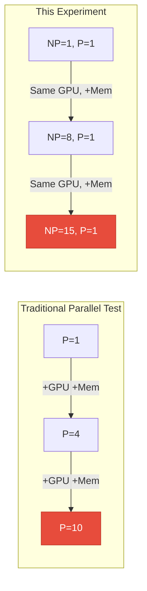
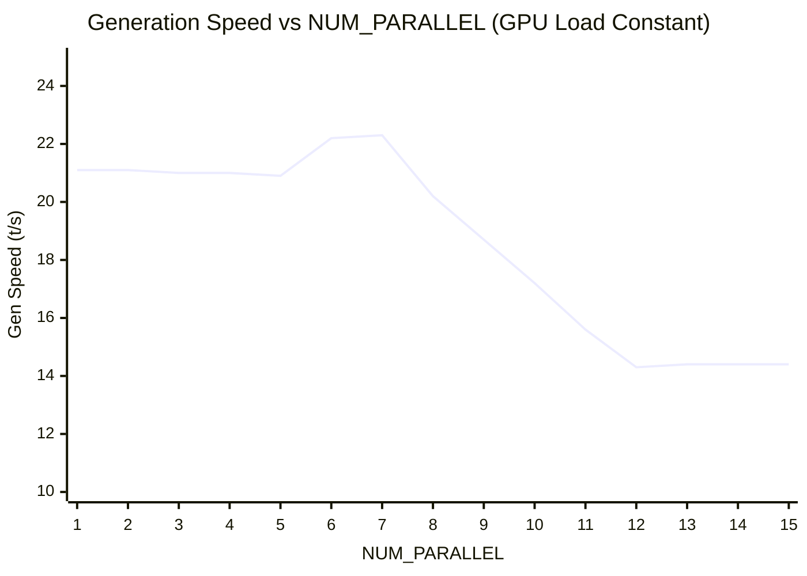
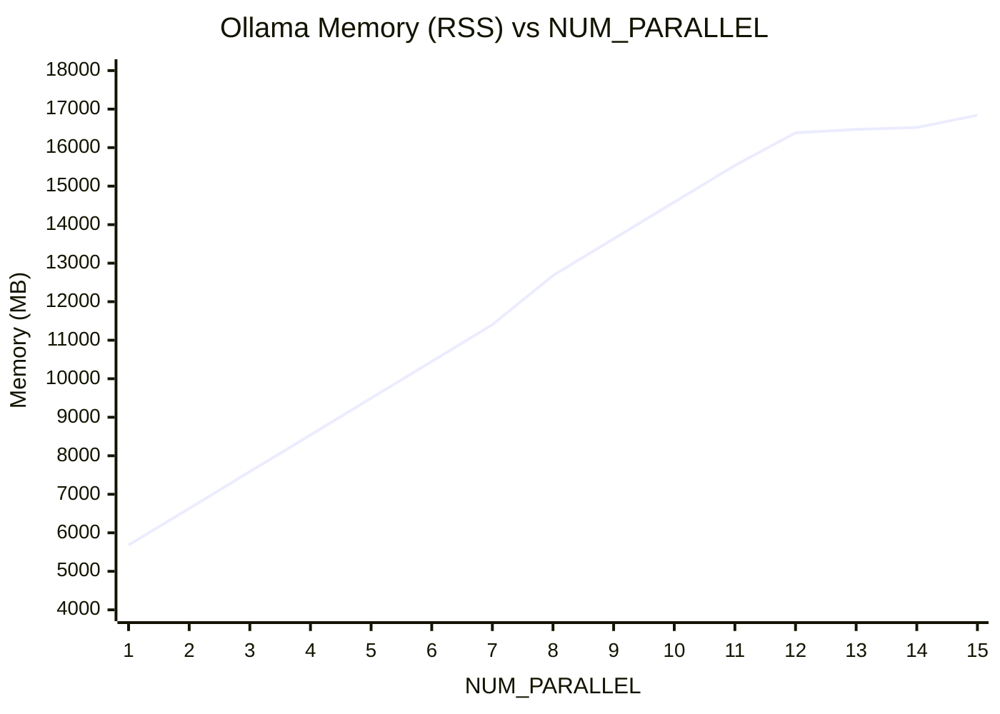

## The Problem: Entangled Variables

In my [previous parallel benchmark](/posts/ollama-parallel-benchmark-cliff/), I sent N concurrent requests with parallelism from 1 to 10. The results showed performance degradation, but two factors were changing simultaneously:

1. **GPU compute contention** — more parallel requests = more matrix operations competing for GPU cycles
2. **Memory pressure** — more parallel requests = more KV cache slots allocated

The speed decline could have been caused by either factor, or both. To understand what's really happening, I needed to **control one variable while changing the other**.

## Experiment Design

### The Key Insight

Ollama pre-allocates KV cache memory based on `OLLAMA_NUM_PARALLEL` at model load time — **regardless of how many requests are actually being served**. Setting `NUM_PARALLEL=10` allocates 10 KV cache buffers even if only 1 request is active.

This means I can:
- **Fix GPU load at exactly 1 request** (constant compute)
- **Increase only memory** by raising `NUM_PARALLEL` (more pre-allocated KV slots)

Any performance change must be caused by **memory pressure alone**.



### Hardware

| Component | Spec |
|-----------|------|
| Machine | **Mac Mini (2024)** |
| Chip | **Apple M4 Pro** |
| Unified Memory | **32 GB** |
| Memory Bandwidth | ~273 GB/s |
| GPU Cores | 20-core |
| Storage | 512 GB SSD (swap target) |
| OS | macOS Sequoia |

Apple Silicon's unified memory architecture means GPU and CPU share the same physical RAM pool. When Ollama allocates KV cache, it directly competes with the OS and other applications for the same 32 GB.

### Model & Configuration

| Parameter | Value | Why |
|-----------|-------|-----|
| Model | `qwen2.5-coder:7b` (Q4_K_M, 4.7 GB) | Small enough to leave room for KV cache growth |
| `num_ctx` | 32,768 (model maximum) | Maximizes KV cache size per slot |
| Quantization | Q4_K_M | Standard Ollama default |
| Seed | 42 | Reproducibility |
| Temperature | 0.0 | Deterministic output |

### Workload

Each benchmark step sends the **exact same prompt**:

> *"Write a Python function that validates an email address using regex. Include type hints, error handling, docstring, and 3 example test cases."*

This prompt is intentionally simple and consistent — the goal isn't to test different prompts, but to measure how the **same workload** performs under different memory conditions.

**Per step (each NUM_PARALLEL level)**:
1. Restart Ollama with `OLLAMA_NUM_PARALLEL=N`
2. Send one warm-up request (triggers model + KV cache allocation)
3. Run **5 benchmark requests** with **3-second cooldown** between each
4. Average the 5 results for stability
5. Record: generation speed, prefill speed, TTFT, memory (RSS), swap usage, page-outs

### What's Being Measured

At each `NUM_PARALLEL` level, the system allocates `N` KV cache buffers of size `num_ctx × per_token_bytes`. For `qwen2.5-coder:7b` with `num_ctx=32768`:

```
KV cache per slot ≈ 1 GB
Model parameters  ≈ 4.7 GB

NP=1:  4.7 + 1×1 =  ~5.7 GB total
NP=8:  4.7 + 8×1 = ~12.7 GB total
NP=13: 4.7 + 13×1 = ~17.7 GB total (+ OS ~8 GB = ~26 GB... approaching 32 GB limit)
```

## Results

| NP | Gen t/s | Prefill t/s | TTFT (ms) | Mem (MB) | Page-Outs | Phase |
|:--:|:-------:|:-----------:|:---------:|:--------:|:---------:|:-----:|
| 1 | **21.1** | 1,085 | 53 | 5,683 | 0 | 🟢 Flat |
| 2 | 21.1 | 1,091 | 53 | 6,632 | 0 | 🟢 |
| 3 | 21.0 | 1,100 | 53 | 7,588 | 0 | 🟢 |
| 4 | 21.0 | 1,093 | 53 | 8,540 | 0 | 🟢 |
| 5 | 20.9 | 1,098 | 53 | 9,495 | 0 | 🟢 |
| 6 | 22.2 | 1,227 | 47 | 10,448 | 0 | 🟢 |
| 7 | 22.3 | 1,197 | 48 | 11,403 | 0 | 🟢 |
| 8 | 20.2 | 1,111 | 52 | 12,679 | 0 | 🟢 |
| 9 | **18.7** | 1,018 | 57 | 13,632 | 0 | 🟡 Degradation |
| 10 | **17.2** | 962 | 60 | 14,587 | **6** | 🟡 |
| 11 | **15.6** | 928 | 63 | 15,536 | **42** | 🔴 |
| 12 | **14.3** | 892 | 65 | 16,386 | **131** | 🔴 Cliff |
| 13 | 14.4 | 919 | 63 | 16,471 | 22 | ⚪ Stabilized |
| 14 | 14.4 | 917 | 63 | 16,522 | 2 | ⚪ |
| 15 | 14.4 | 923 | 63 | 16,840 | 9 | ⚪ |

### Visualization





## Analysis: Three Distinct Phases

### Phase 1: Flat Zone (NP=1–8)

Generation speed stays rock-steady at **~21 t/s** across 8 levels, while memory grows linearly from 5.7 to 12.7 GB. This proves that:

- **KV cache pre-allocation consumes real memory** (~1 GB per slot)
- **Unused KV slots have zero impact on inference speed** — the GPU processes the same single request regardless

The slight speed bump at NP=6–7 (22.2–22.3 t/s) is measurement noise within the ±1 t/s variance.

### Phase 2: Degradation Zone (NP=9–12)

| NP | Speed Drop | Page-Outs | What's Happening |
|:--:|:----------:|:---------:|:----------------|
| 9 | -11% | 0 | Memory pressure begins; OS starts compressing pages |
| 10 | -18% | 6 | **First swap to SSD** — page-outs detected |
| 11 | -26% | 42 | Swap activity accelerating |
| 12 | -32% | **131** | Peak swap activity; speed cliff |

At NP=9, Ollama RSS hits 13.6 GB. Combined with macOS (~8 GB) and other processes, the system approaches the 32 GB ceiling. The OS responds in stages:

1. **Memory compression** (NP=9) — macOS compresses inactive pages in RAM. Small CPU overhead, minor speed impact.
2. **Page-outs to SSD** (NP=10+) — when compression isn't enough, pages are written to SSD swap. SSD bandwidth (~3 GB/s) is ~100× slower than memory bandwidth (~273 GB/s).
3. **Swap thrashing** (NP=12) — 131 page-outs during a simple P=1 benchmark. The GPU must wait for swapped-out data to be read back from SSD.

### Phase 3: Stabilized Zone (NP=13–15)

Surprisingly, speed **stops declining** at ~14.4 t/s and holds steady through NP=15. Why?

This is macOS's memory management reaching **equilibrium**. The OS has identified which pages are "hot" (actively used by the running request) and which are "cold" (unused KV cache slots). Hot pages stay in RAM; cold pages get compressed or swapped. Since only 1 request is active, the working set is relatively small and stable.

## Key Takeaways

### 1. Memory Pressure Alone Causes 32% Speed Loss

With **identical GPU load** (P=1), increasing memory from 5.7 to 16.8 GB via KV cache pre-allocation reduced generation speed from 21.1 to 14.3 t/s. This is pure memory-induced degradation.

### 2. The "Cliff" Is Actually a Slope

Unlike GPU contention (which causes immediate throughput saturation), memory pressure creates a **gradual degradation curve** from NP=9 to NP=12, then stabilizes. There's no single catastrophic failure point — it's a ~4-step slide.

### 3. macOS Recovers Gracefully

The stabilization at NP=13+ shows macOS handles memory overcommit reasonably well through compression and intelligent page eviction. The system doesn't crash or become unresponsive — it just gets 32% slower.

### 4. Pre-Allocated ≠ Free

Setting `OLLAMA_NUM_PARALLEL` higher than needed wastes real memory on empty KV cache buffers. On a 32 GB machine with a 7B model, `NUM_PARALLEL > 8` starts causing measurable performance degradation even for a single active request.

## Practical Recommendations

| System RAM | Model Size | Max Safe NUM_PARALLEL |
|:----------:|:----------:|:---------------------:|
| 16 GB | 7B (Q4) | 3–4 |
| 32 GB | 7B (Q4) | **8** |
| 32 GB | 30B (Q4) | 2–3 |
| 64 GB | 7B (Q4) | 20+ |
| 64 GB | 30B (Q4) | 8–10 |

> **Formula**: `Max NP ≈ (System RAM − Model Size − 8 GB for OS) ÷ KV Cache per Slot`

## Reproducing This Experiment

```bash
git clone https://github.com/rockyRunnr/ollama-bench
cd ollama-bench && pip install -e .

# Run the pure memory pressure test
python memory_pressure_test.py \
    --model qwen2.5-coder:7b \
    --num-ctx 32768 \
    --max-np 15 \
    --output results.json
```

The script automatically restarts Ollama at each `NUM_PARALLEL` level, runs 5 requests with 3-second cooldowns, and monitors swap via `vm_stat`.

## GitHub

- [rockyRunnr/ollama-bench](https://github.com/rockyRunnr/ollama-bench)

---

*The most interesting finding isn't the speed loss — it's the three-phase behavior. Memory pressure doesn't cause a binary "works/broken" state. It causes a gradual degradation that eventually stabilizes as the OS finds equilibrium between hot and cold pages.*
