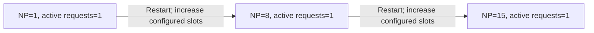
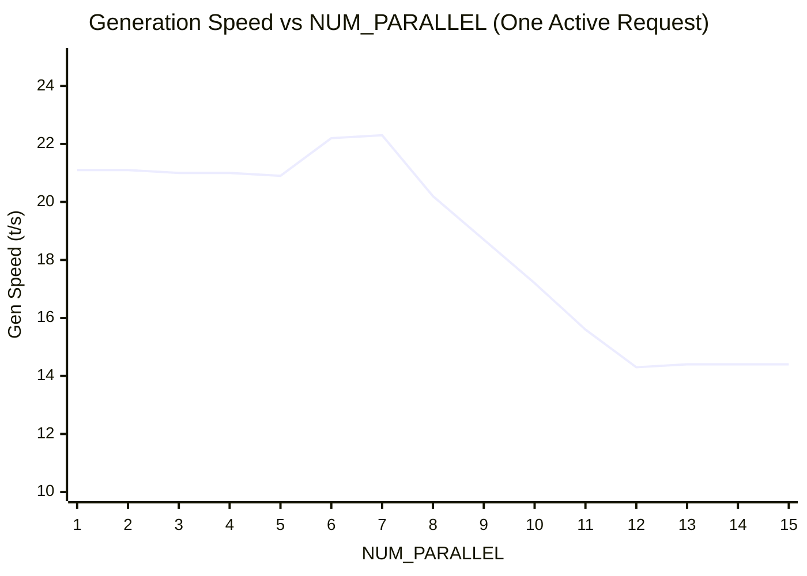
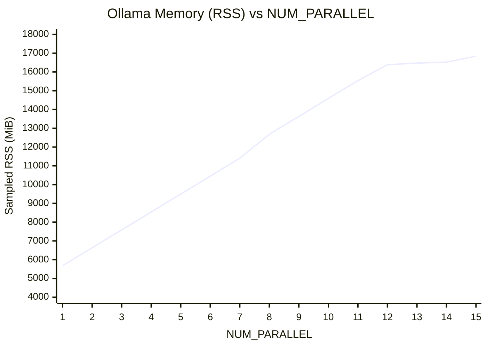

**Correction — September 13, 2026:** The original post treated system-wide Pageouts as proof of KV-specific swap thrashing and labeled prefill duration as TTFT. It also called the experiment purely memory-isolated. This revision preserves the measurements while separating them from unverified mechanisms and removes untested safe-concurrency recommendations.

## The Question

The [parallel sweep](/posts/ollama-parallel-benchmark-cliff/) varied active requests within a fixed four-slot configuration. Its RSS stayed almost constant as concurrency increased, so that sweep did not isolate swap-induced slowdown. Changing the configured slot count was a separate experiment.

Here I kept **one active request** and increased `OLLAMA_NUM_PARALLEL`, restarting Ollama at each level. In the tested configuration, more configured slots increased the memory provisioned at model load even when most slots were idle. This reduces the confounding effect of simultaneous active requests, but does not prove that GPU work, caching, engine configuration, and system state were identical.

## Experiment Design


```mermaid
flowchart LR
    A["NP=1, active requests=1"] -->|"Restart; increase configured slots"| B["NP=8, active requests=1"]
    B -->|"Restart; increase configured slots"| C["NP=15, active requests=1"]
```

The hypothesis was that larger preallocated capacity would increase memory pressure and affect the same sequential workload. Page-level attribution would require additional instrumentation.

### Hardware

| Component | Spec |
|-----------|------|
| Machine | **Mac Mini (2024)** |
| Chip | **Apple M4** |
| Unified Memory | **32 GB** |
| Memory Bandwidth | ~120 GB/s |
| GPU Cores | 10-core |
| Storage | 256 GB SSD (swap target) |
| OS | macOS Sequoia |

Apple Silicon's unified memory architecture means GPU and CPU share the same physical RAM pool. When Ollama allocates KV cache, it directly competes with the OS and other applications for the same 32 GB.

### Model & Configuration

| Parameter | Value | Why |
|-----------|-------|-----|
| Model | `qwen2.5-coder:7b` (Q4_K_M, 4.7 GB) | Small enough to leave room for KV cache growth |
| `num_ctx` | 32,768 | Context setting used for each configured slot |
| Quantization | Q4_K_M | Standard Ollama default |
| Seed | 42 | Reproducibility |
| Temperature | 0.0 | Reduce sampling variability |

### Workload

Each benchmark step sends the **exact same prompt**:

> *"Write a Python function that validates an email address using regex. Include type hints, error handling, docstring, and 3 example test cases."*

This prompt is intentionally simple and consistent — the goal isn't to test different prompts, but to measure how the **same workload** performs under different memory conditions.

**Per step (each NUM_PARALLEL level)**:
1. Restart Ollama with `OLLAMA_NUM_PARALLEL=N`
2. Send one warm-up request (triggers model + KV cache allocation)
3. Run **5 benchmark requests** with **3-second cooldown** between each
4. Average the 5 results for stability
5. Record: generation speed, prefill speed and duration, sampled RSS, system swap usage, and changes in system Pageouts

### What the Script Measures

The [script](https://github.com/rockyRunnr/ollama-bench/blob/main/memory_pressure_test.py) computes generation and prefill speed from Ollama's token counts and durations. Its `ttft_ms` field is `prompt_eval_duration / 10⁶`; requests are non-streaming, so it does not measure client-observed time to first token.

`memory_mb` is the larger of the pre- and post-measurement RSS sums for matching Ollama processes. The calculation divides by 1024², so the values are MiB despite the original MB field name. This is not a continuously sampled peak, and shared pages can be counted in multiple processes.

`swap_used_mb` comes from `psutil.swap_memory()`. `page_outs` is the change in the system-wide `vm_stat` Pageouts counter across each five-request measurement interval. Neither identifies the owning process or buffer. The observed roughly 950 MiB RSS increase per additional slot in the early rows is consistent with increased KV provisioning; it is not a direct per-buffer allocation trace.

## Results

| NP | Gen t/s | Prefill t/s | Prefill (ms) | Sampled RSS (MiB) | Pageouts delta | Phase |
|:--:|:-------:|:-----------:|:---------:|:--------:|:---------:|:-----:|
| 1 | **21.1** | 1,085 | 53 | 5,683 | 0 | 🟢 Flat |
| 2 | 21.1 | 1,091 | 53 | 6,632 | 0 | 🟢 |
| 3 | 21.0 | 1,100 | 53 | 7,588 | 0 | 🟢 |
| 4 | 21.0 | 1,093 | 53 | 8,540 | 0 | 🟢 |
| 5 | 20.9 | 1,098 | 53 | 9,495 | 0 | 🟢 |
| 6 | 22.2 | 1,227 | 47 | 10,448 | 0 | 🟢 |
| 7 | 22.3 | 1,197 | 48 | 11,403 | 0 | 🟢 |
| 8 | 20.2 | 1,111 | 52 | 12,679 | 0 | 🟢 |
| 9 | **18.7** | 1,018 | 57 | 13,632 | 0 | 🟡 Degradation |
| 10 | **17.2** | 962 | 60 | 14,587 | **6** | 🟡 |
| 11 | **15.6** | 928 | 63 | 15,536 | **42** | 🔴 |
| 12 | **14.3** | 892 | 65 | 16,386 | **131** | 🔴 Cliff |
| 13 | 14.4 | 919 | 63 | 16,471 | 22 | ⚪ Stabilized |
| 14 | 14.4 | 917 | 63 | 16,522 | 2 | ⚪ |
| 15 | 14.4 | 923 | 63 | 16,840 | 9 | ⚪ |

### Visualization


```mermaid
xychart-beta
    title "Generation Speed vs NUM_PARALLEL (One Active Request)"
    x-axis "NUM_PARALLEL" [1, 2, 3, 4, 5, 6, 7, 8, 9, 10, 11, 12, 13, 14, 15]
    y-axis "Gen Speed (t/s)" 10 --> 25
    line [21.1, 21.1, 21.0, 21.0, 20.9, 22.2, 22.3, 20.2, 18.7, 17.2, 15.6, 14.3, 14.4, 14.4, 14.4]
```


```mermaid
xychart-beta
    title "Ollama Memory (RSS) vs NUM_PARALLEL"
    x-axis "NUM_PARALLEL" [1, 2, 3, 4, 5, 6, 7, 8, 9, 10, 11, 12, 13, 14, 15]
    y-axis "Sampled RSS (MiB)" 4000 --> 18000
    line [5683, 6632, 7588, 8540, 9495, 10448, 11403, 12679, 13632, 14587, 15536, 16386, 16471, 16522, 16840]
```

## Observations and Interpretation

### NP=1–8: RSS rises with relatively stable speed

Generation speed stays around 20–22 t/s while sampled RSS rises from 5,683 to 12,679 MiB. This is consistent with extra configured capacity consuming memory before those slots serve requests. It does not prove that unused slots have zero execution cost. The modest speed variation was not accompanied by per-run uncertainty estimates in the saved aggregate results.

### NP=9–12: speed falls and Pageouts increase

The raw result changes from **21.09 t/s at NP=1 to 14.31 t/s at NP=12**, a 32.1% reduction. RSS at NP=12 is 16,385.6 MiB. The Pageouts deltas are 0, 6, 42, and 131 at NP=9, 10, 11, and 12 respectively. [Raw results](https://github.com/rockyRunnr/ollama-bench/blob/main/memory_pressure_results.json)

These observations are consistent with memory pressure contributing to slowdown, but they do not identify a particular compression or paging mechanism. **Swap was already about 1,789 MiB at NP=1**. NP=10 was the first positive Pageouts delta in these measurement intervals, not the first time the system had used swap. Recorded swap usage actually declined to about 1,773 MiB at NP=12.

The original statements that NP=9 marked the start of compression, that NP=12 proved swap thrashing, and that the GPU was waiting on swapped KV pages were not supported by these counters. Resolving that would require time-correlated CPU/GPU measurements, page-ins, compressor statistics, and process/resource attribution.

### NP=13–15: speed levels off

The saved results level off near 14.4 t/s. A stable working set or changed reclamation behavior could contribute, but the measurements do not show which pages became hot or cold, or prove that idle GPU KV buffers were swapped. This is an observed plateau, not a verified OS-equilibrium mechanism.

## What to Take from the Experiment

The result supports a practical investigation direction: **configured capacity can increase resident memory and correlate with slower service even with one active request**. It does not establish a universal 32% penalty, or a memory-only causal effect with all other variables excluded.

For this 32 GB, 7B, 32K-context experiment, slowdown became visible around NP=9. I have removed the earlier table of “max safe” settings for 16 GB and 64 GB machines and other model sizes because those configurations were not measured here. Capacity planning also needs weights, recurrent state, compute buffers, other processes, and workload-dependent peaks; reserving a fixed 8 GB for the OS cannot guarantee safety.

A stronger follow-up would record actual KV allocation, continuously sampled process and GPU memory, client-streamed TTFT, repeated-run uncertainty, and matched warm-up/cache conditions while varying configured capacity.

## Reproducing This Experiment

```bash
git clone https://github.com/rockyRunnr/ollama-bench
cd ollama-bench && pip install -e .

# Run the configured-slot sweep with one active request
python memory_pressure_test.py \
    --model qwen2.5-coder:7b \
    --num-ctx 32768 \
    --max-np 15 \
    --output results.json
```

The script automatically restarts Ollama at each `NUM_PARALLEL` level, runs 5 requests with 3-second cooldowns, and records system-wide Pageouts from `vm_stat` plus swap usage from `psutil`. These are system-level counters.

## GitHub

- [rockyRunnr/ollama-bench](https://github.com/rockyRunnr/ollama-bench)

---

*The measured speed decline and plateau motivated the later KV allocation investigation. Identifying the exact memory mechanism remains separate from observing those phases.*
