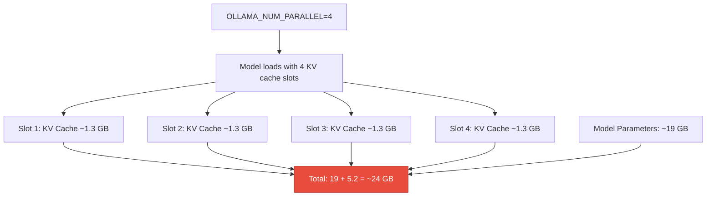
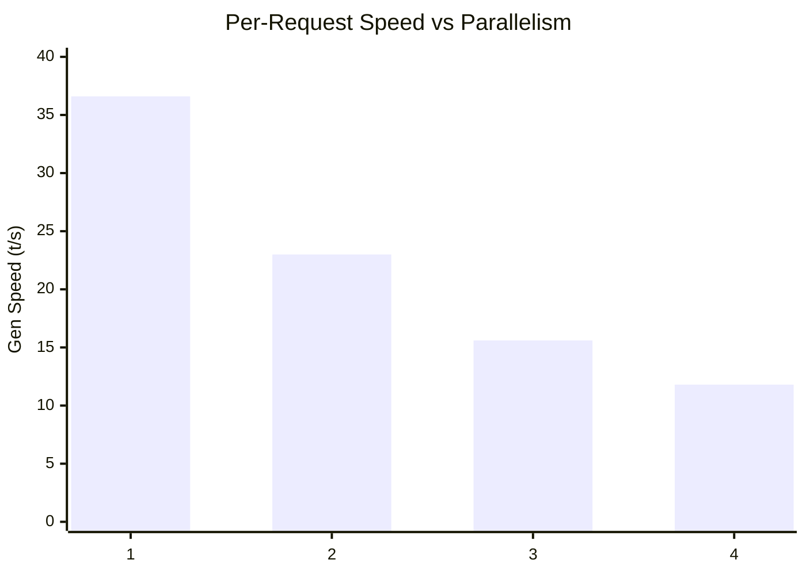
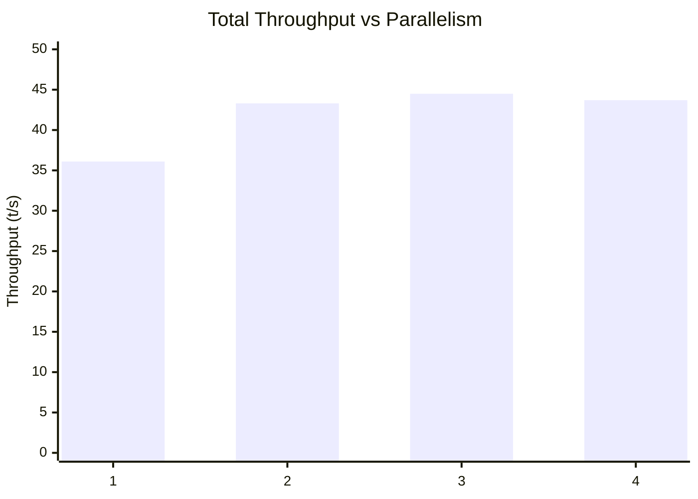

**Correction — September 13, 2026:** Active requests (`P`) and configured slots (`OLLAMA_NUM_PARALLEL`) are different variables. The four-slot sweep kept RSS nearly constant; it does not show rising KV allocation or prove swap as P increases. Prefill duration replaces the original TTFT label, and the load timeout is no longer presented as a confirmed GPU OOM.

## The Question

After benchmarking [context growth](/posts/ollacode-prompt-optimization-benchmark/) and seeing stable memory across rounds, I had a nagging question:

> **Can I force KV cache memory pressure to the point of SSD swap and observe the performance cliff?**

The experiment exposed two observations: a timeout when trying to warm up a ten-slot configuration, and lower per-request generation speed as active concurrency increased within a four-slot configuration. Neither observation alone proves swap-induced slowdown.

## How Ollama Handles Parallel Requests

In the configuration tested here, `OLLAMA_NUM_PARALLEL` controlled the configured serving slots and associated KV provisioning at load time. Active requests could use fewer slots. The following diagram is a rough capacity illustration from the original notes, not a direct buffer-allocation measurement:


```mermaid
flowchart TD
    A["OLLAMA_NUM_PARALLEL=4"] --> B["Model loads with 4 KV cache slots"]
    B --> C["Slot 1: KV Cache ~1.3 GB"]
    B --> D["Slot 2: KV Cache ~1.3 GB"]
    B --> E["Slot 3: KV Cache ~1.3 GB"]
    B --> F["Slot 4: KV Cache ~1.3 GB"]
    G["Model Parameters: ~19 GB"]

    C --> H["Total: 19 + 5.2 = ~24 GB"]
    D --> H
    E --> H
    F --> H
    G --> H

    style H fill:#e74c3c,stroke:#c0392b,color:#fff
```

The KV cache buffers are allocated to their **maximum size** (`num_ctx`) even before any tokens are processed. It's like building hotel rooms before guests arrive — the memory is consumed regardless of occupancy.

## Experiment Setup

| Parameter | Value |
|-----------|-------|
| Model | `qwen3-coder:30b` |
| Hardware | Mac Mini, Apple Silicon, **32 GB** unified memory |
| Benchmark | `ollama-bench --mode parallel-sweep` |
| Prompt | Fixed email validation task (identical per request) |
| Seed | 42, Temperature 0.0 |

### The Sweep

I added a `parallel-sweep` mode to [ollama-bench](https://github.com/rockyRunnr/ollama-bench) that:

1. Fires **P** identical concurrent requests (P = 1, 2, 3, ...)
2. Measures per-request gen speed, total throughput, prefill duration, and sampled RSS
3. Auto-detects the **performance cliff** (where gen speed drops below 50% of baseline)

## Results

### Attempt 1: `OLLAMA_NUM_PARALLEL=10` → Warm-Up Timeout

```bash
OLLAMA_NUM_PARALLEL=10 ollama serve
ollama-bench --model qwen3-coder:30b --mode parallel-sweep --max-parallel 10
```

**Observed result**: The warm-up request timed out; model loading did not complete within the test timeout. This record does not include a confirmed GPU OOM error.

Why? With 10 KV cache slots:
- Model parameters: ~19 GB
- KV cache: ~1.3 GB × 10 = ~13 GB
- **Total: ~32 GB** — exactly equal to physical RAM

Those rough numbers leave little room for the OS, other processes, and compute buffers. Memory pressure is a plausible explanation for the timeout, but this test did not establish swap thrashing or the exact failing allocation.

### Attempt 2: `OLLAMA_NUM_PARALLEL=4` → **Cliff Found!**

| P | Avg Gen t/s | Total Throughput t/s | Prefill (ms) | Sampled RSS (MiB) |
|:-:|:-----------:|:--------------------:|:---------:|:-----------:|
| **1** | **36.6** | 36.1 | 27 | 24,208 |
| 2 | 23.0 (-37%) | 43.3 | 301 | 24,210 |
| **3** | **15.6** (-57%) ⚠️ | **44.5** (peak) | 163 | 24,212 |
| 4 | 11.8 (-68%) | 43.7 | 616 | 24,197 |

The original `ttft_ms` field is `prompt_eval_duration`, not streamed first-token latency. RSS is sampled before and after each group of requests, not continuously. [Measurement implementation](https://github.com/rockyRunnr/ollama-bench/blob/main/ollama_bench/core.py)

### Key Metrics Explained

**Avg Gen t/s** — Per-request generation speed. This is what each individual user would experience. It drops dramatically because all parallel requests share the same GPU compute:


```mermaid
xychart-beta
    title "Per-Request Speed vs Parallelism"
    x-axis [1, 2, 3, 4]
    y-axis "Gen Speed (t/s)" 0 --> 40
    bar [36.6, 23.0, 15.6, 11.8]
```

**Total Throughput t/s** — Combined output across all requests. This is the "server efficiency" metric. It peaks at P=3 (44.5 t/s) then starts declining:


```mermaid
xychart-beta
    title "Total Throughput vs Parallelism"
    x-axis [1, 2, 3, 4]
    y-axis "Throughput (t/s)" 0 --> 50
    bar [36.1, 43.3, 44.5, 43.7]
```

## Analysis

### 1. Nearly constant RSS within the four-slot sweep

RSS stayed around 24,200 MiB from P=1 to P=4. This is consistent with capacity being provisioned for the configured four slots before all became active. It does not measure a new per-request KV allocation as P increases.

The earlier subtraction of a roughly 19 GB weight estimate from roughly 24 GB RSS mixed quantities and was not a reliable measurement of extra-slot KV bytes. A controlled sweep of configured slots and actual buffer logs is needed; the [one-active-request experiment](/posts/ollama-memory-pressure-experiment/) explores that separately.

### 2. Performance Cliff at P=3

The cliff was detected at P=3, where individual request speed dropped below 50% of baseline (36.6 → 15.6 t/s). At this point, each user would experience about **2.35× the generation time per token** compared to having the model to themselves.

### 3. Throughput Sweet Spot

Total throughput peaked at P=3 (44.5 t/s), a **23% improvement** over single-request. P=4 was slightly lower in this run. Shared execution resources are a plausible explanation, but without repeated runs and profiler data this does not establish a universal optimum or isolate compute from bandwidth and scheduling effects.

### 4. Capacity and service speed need separate experiments

The ten-slot timeout motivates checking memory provisioning. The four-slot sweep shows per-request speed decreasing while aggregate throughput initially rises. It is possible to get better total throughput and worse individual latency at the same time.

## Interpreting These Settings

The recorded P=1 value of 36.6 t/s was measured with `OLLAMA_NUM_PARALLEL=4`, not with that setting equal to one. The earlier recommendation table mistakenly relabeled the P values as configured slot counts and has been removed.

For this run, P=1 gave the highest per-request speed and P=3 the highest aggregate throughput. Choosing a configuration requires matching the user's latency target and measuring memory headroom. A fixed fraction such as 80% of physical RAM is only a budgeting heuristic, not a safety guarantee.

## Running This Yourself

```bash
git clone https://github.com/rockyRunnr/ollama-bench
cd ollama-bench && pip install -e .

# Set parallelism (requires Ollama restart)
OLLAMA_NUM_PARALLEL=4 ollama serve

# Run the sweep
ollama-bench --model your-model --mode parallel-sweep --max-parallel 4 --output sweep.json
```

## GitHub

- [rockyRunnr/ollama-bench](https://github.com/rockyRunnr/ollama-bench) — now with `parallel-sweep` mode

---

*Configured capacity, active concurrency, and per-request latency are separate variables. These observations motivate further measurement rather than an exact universal cliff prediction.*
