## The Question

After benchmarking [context growth](/posts/ollacode-prompt-optimization-benchmark/) and seeing stable memory across rounds, I had a nagging question:

> **Can I force KV cache memory pressure to the point of SSD swap and observe the performance cliff?**

The answer: **yes, with parallel requests.** Each concurrent request gets its own KV cache allocation. Scale up parallelism → scale up KV cache memory → eventually exceed physical RAM.

## How Ollama Handles Parallel Requests

Ollama's `OLLAMA_NUM_PARALLEL` setting controls how many requests can be served simultaneously. The critical insight is that **KV cache memory is pre-allocated per slot at model load time**:


The KV cache buffers are allocated to their **maximum size** (`num_ctx`) even before any tokens are processed. It's like building hotel rooms before guests arrive — the memory is consumed regardless of occupancy.

## Experiment Setup

| Parameter | Value |
|-----------|-------|
| Model | `qwen3-coder:30b` |
| Hardware | Mac Mini, Apple Silicon, **32 GB** unified memory |
| Benchmark | `ollama-bench --mode parallel-sweep` |
| Prompt | Fixed email validation task (identical per request) |
| Seed | 42, Temperature 0.0 |

### The Sweep

I added a `parallel-sweep` mode to [ollama-bench](https://github.com/rockyRunner-ai/ollama-bench) that:

1. Fires **P** identical concurrent requests (P = 1, 2, 3, ...)
2. Measures per-request gen speed, total throughput, TTFT, and memory
3. Auto-detects the **performance cliff** (where gen speed drops below 50% of baseline)

## Results

### Attempt 1: `OLLAMA_NUM_PARALLEL=10` → **OOM Timeout**

```bash
OLLAMA_NUM_PARALLEL=10 ollama serve
ollama-bench --model qwen3-coder:30b --mode parallel-sweep --max-parallel 10
```

**Result**: The model failed to load. Warm-up request timed out.

Why? With 10 KV cache slots:
- Model parameters: ~19 GB
- KV cache: ~1.3 GB × 10 = ~13 GB
- **Total: ~32 GB** — exactly equal to physical RAM

macOS + other processes already consume ~4-6 GB, so Ollama was fighting for memory before it could even serve a single request. Swap thrashing made it unresponsive.

### Attempt 2: `OLLAMA_NUM_PARALLEL=4` → **Cliff Found!**

| P | Avg Gen t/s | Total Throughput t/s | TTFT (ms) | Memory (MB) |
|:-:|:-----------:|:--------------------:|:---------:|:-----------:|
| **1** | **36.6** | 36.1 | 27 | 24,208 |
| 2 | 23.0 (-37%) | 43.3 | 301 | 24,210 |
| **3** | **15.6** (-57%) ⚠️ | **44.5** (peak) | 163 | 24,212 |
| 4 | 11.8 (-68%) | 43.7 | 616 | 24,197 |

### Key Metrics Explained

**Avg Gen t/s** — Per-request generation speed. This is what each individual user would experience. It drops dramatically because all parallel requests share the same GPU compute:


**Total Throughput t/s** — Combined output across all requests. This is the "server efficiency" metric. It peaks at P=3 (44.5 t/s) then starts declining:


## Analysis

### 1. Memory Pre-Allocation Confirmed

Even at P=1, memory was **24.2 GB** — not the 19 GB we'd see in single-slot mode. This proves that all 4 KV cache slots were pre-allocated at model load time, consuming ~5.2 GB for empty KV buffers.

```
Single slot (NUM_PARALLEL=1):  ~19 GB
Four slots  (NUM_PARALLEL=4):  ~24 GB  (+5 GB for 3 extra KV buffers)
Ten slots   (NUM_PARALLEL=10): ~32 GB  (→ OOM, can't even load)
```

### 2. Performance Cliff at P=3

The cliff was detected at P=3, where individual request speed dropped below 50% of baseline (36.6 → 15.6 t/s). At this point, each user would experience nearly **3× slower** responses compared to having the model to themselves.

### 3. Throughput Sweet Spot

Total throughput peaked at P=3 (44.5 t/s), a **23% improvement** over single-request. Beyond P=3, adding more parallelism didn't help — GPU compute contention overcame the batching benefit.

### 4. The Two Failure Modes

```mermaid
flowchart TD
    A["Increase Parallelism"] --> B{"Memory > Physical RAM?"}
    B -->|Yes| C["🔴 OOM: Model can't load<br/>(NUM_PARALLEL=10)"]
    B -->|No| D{"GPU saturated?"}
    D -->|Yes| E["🟡 Cliff: Per-request speed tanks<br/>(NUM_PARALLEL=4, P≥3)"]
    D -->|No| F["🟢 Healthy: Throughput scales<br/>(NUM_PARALLEL=4, P=1-2)"]

    style C fill:#e74c3c,stroke:#c0392b,color:#fff
    style E fill:#f39c12,stroke:#d35400,color:#fff
    style F fill:#27ae60,stroke:#1e8449,color:#fff
```



## Practical Recommendations

For a **32 GB Mac with a 30B model**:

| Setting | Use Case | Recommendation |
|---------|----------|----------------|
| `NUM_PARALLEL=1` | Single user, best speed | ✅ Default, 36.6 t/s |
| `NUM_PARALLEL=2` | Two users/sessions | ⚠️ Acceptable, 23 t/s each |
| `NUM_PARALLEL=3` | Server with multiple users | ⚠️ Near cliff, 15.6 t/s each |
| `NUM_PARALLEL=4+` | High concurrency | ❌ Diminishing returns |
| `NUM_PARALLEL=10` | Ambitious | ❌ Won't load |

> **Rule of thumb**: On Apple Silicon, keep `NUM_PARALLEL` such that `model_size + (N × KV_cache_per_slot) < 80% of physical RAM`.

## Running This Yourself

```bash
git clone https://github.com/rockyRunner-ai/ollama-bench
cd ollama-bench && pip install -e .

# Set parallelism (requires Ollama restart)
OLLAMA_NUM_PARALLEL=4 ollama serve

# Run the sweep
ollama-bench --model your-model --mode parallel-sweep --max-parallel 4 --output sweep.json
```

## GitHub

- [rockyRunner-ai/ollama-bench](https://github.com/rockyRunner-ai/ollama-bench) — now with `parallel-sweep` mode

---

*The performance cliff exists and is predictable. Know your model size, know your KV cache, know your RAM — and you can calculate exactly where the cliff will be.*
