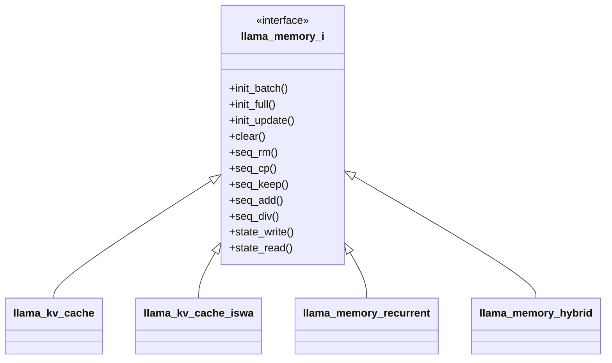
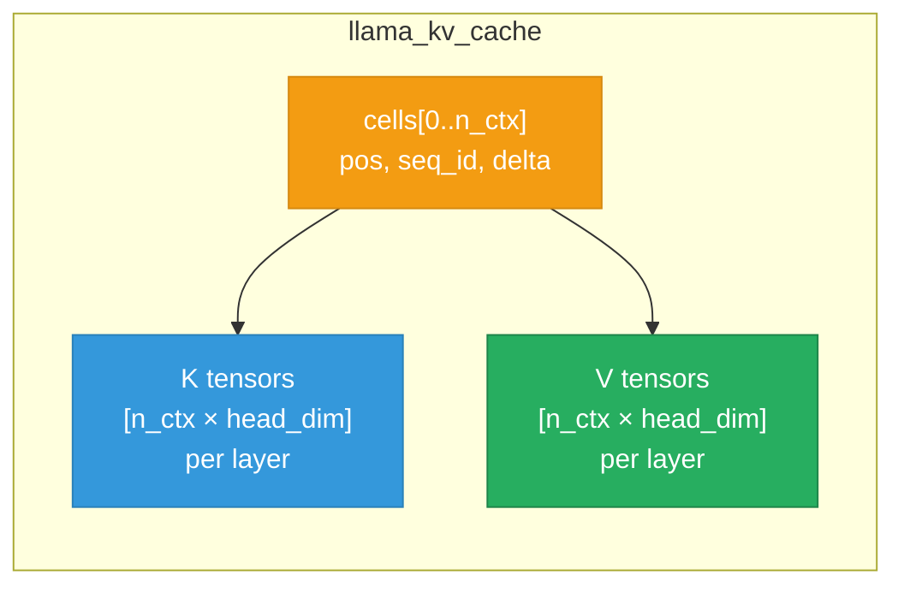
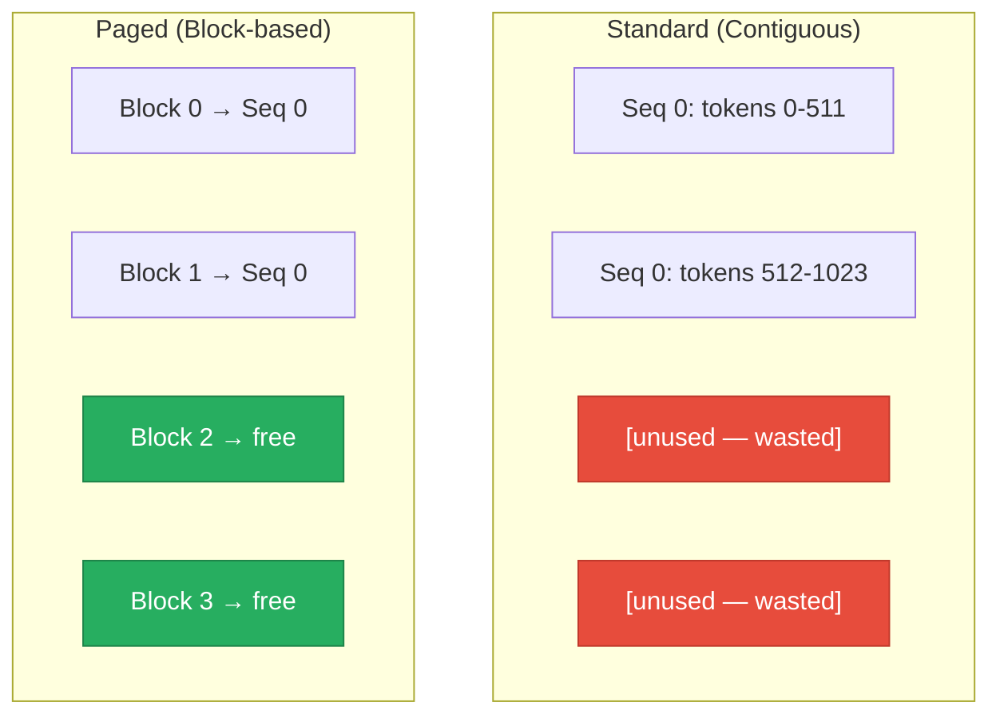

## How LLMs Use Memory During Inference

When a transformer model generates text, it computes **Key** and **Value** tensors for every token at every layer. These tensors are cached so they don't need to be recomputed — this is the **KV cache**.

The size scales linearly with context length:

```
KV cache size = n_ctx × n_layers × 2 × (n_heads_kv × head_dim) × dtype_size
```

For a 27B parameter model with an 8K context window and FP16 cache, that's roughly **2 GB** of memory — allocated entirely upfront, regardless of how many tokens are actually used.

This is the fundamental tension: **static allocation is simple and fast, but wasteful.**

## llama.cpp's Memory Architecture

### The `llama_memory_i` Interface

`llama.cpp` doesn't hardcode a single KV cache implementation. Since March 2025 (PR [#11213](https://github.com/ggml-org/llama.cpp/pull/11213)), all memory management goes through a polymorphic interface:



Each implementation handles a different model architecture:

| Class | Purpose | Pattern |
|-------|---------|---------|
| `llama_kv_cache` | Standard attention (GPT, LLaMA, Qwen) | Contiguous flat buffer |
| `llama_kv_cache_iswa` | Interleaved Sliding Window Attention | Composes 2 `llama_kv_cache` instances |
| `llama_memory_recurrent` | Recurrent models (Mamba, RWKV) | State-based, no cache |
| `llama_memory_hybrid` | Hybrid models (Jamba, Granite) | Composes attention + recurrent |

The factory is in `llama_model::create_memory()` — it inspects the model architecture and instantiates the appropriate class.

### How the Standard KV Cache Works

`llama_kv_cache` is the workhorse (~2200 lines). Its core data structure:



Key characteristics:

- **Pre-allocated**: The full `n_ctx` buffer is allocated at context creation
- **Contiguous**: All cells are stored in a single buffer per layer
- **Slot-based**: Tokens are assigned to cells using a slot allocator
- **Defragmentable**: Can compact fragmented cells via copy operations

The contiguous layout enables efficient GPU kernel execution — a single `memcpy` or a single matrix multiplication covers the entire cache.

### The Context Object Pattern

This is a subtle but critical design detail. When the model processes a batch, the KV cache creates a **context object**:

```cpp
// What llama_kv_cache::init_batch() returns
class llama_kv_cache_context : public llama_memory_context_i {
    const llama_kv_cache * kv;
    std::vector<slot_info> sinfos;
    std::vector<llama_ubatch> ubatches;
    // ...
};
```

This context object is then passed to the **graph builder**, which uses it to construct the computation graph:

```cpp
// Inside llama-graph.cpp
const auto * mctx = static_cast<const llama_kv_cache_context *>(params.mctx);
```

Note the `static_cast` — the graph builder assumes the exact type. This has important implications for anyone implementing a new memory strategy (more on this below).

## PagedAttention: The Concept

The idea comes from [vLLM](https://arxiv.org/abs/2309.06180): instead of one monolithic buffer, divide the KV cache into fixed-size **blocks** (pages).



Benefits:

- **No fragmentation waste** — blocks are allocated only as needed
- **Copy-on-Write** — shared prefixes between sequences can share physical blocks
- **Dynamic growth** — the pool can grow as demand increases

Trade-offs:

- **Non-contiguous memory** — requires scatter/gather for attention kernels
- **Block management overhead** — tracking block tables adds CPU work
- **Kernel complexity** — GPU kernels need to handle non-contiguous memory access

## Implementation: Composing the Existing Cache

The cleanest way to add PagedAttention to `llama.cpp` is by **composing** the existing `llama_kv_cache`, not modifying it:

```cpp
class llama_kv_cache_paged : public llama_memory_i {
private:
    std::unique_ptr<llama_kv_cache> kv;  // inner pool
    uint32_t block_size;                  // tokens per block (default: 256)
    uint32_t n_blocks;                    // total blocks
    std::vector<bool> block_used;         // per-block tracking
};
```

The constructor aligns the requested cache size to block boundaries:

```cpp
const uint32_t kv_size_aligned =
    ((kv_size + block_size - 1) / block_size) * block_size;
n_blocks = kv_size_aligned / block_size;

kv = std::make_unique<llama_kv_cache>(
        model, type_k, type_v, v_trans, offload, unified,
        kv_size_aligned, n_seq_max, n_pad,
        n_swa, swa_type, filter, reuse);
```

All 15+ `llama_memory_i` interface methods delegate to the inner cache:

```cpp
bool llama_kv_cache_paged::seq_rm(llama_seq_id seq_id,
                                   llama_pos p0, llama_pos p1) {
    bool res = kv->seq_rm(seq_id, p0, p1);
    update_block_usage();
    return res;
}
```

### The `static_cast` Trap

My first implementation created a custom `llama_kv_cache_paged_context` class that wrapped the inner context. It compiled cleanly. It segfaulted on the first run.

The root cause was in `llama-graph.cpp`:

```cpp
const auto * mctx = static_cast<const llama_kv_cache_context *>(params.mctx);
```

`static_cast` does **zero runtime type checking**. My wrapper class was not a `llama_kv_cache_context`, so the cast produced a garbage pointer — immediate segfault.

The fix is straightforward: don't wrap the context. The paged cache returns the inner `llama_kv_cache`'s context directly:

```cpp
llama_memory_context_ptr llama_kv_cache_paged::init_batch(
        llama_batch_allocr & balloc,
        uint32_t n_ubatch, bool embd_all) {
    return kv->init_batch(balloc, n_ubatch, embd_all);
}
```

This works because the paged layer manages **block metadata** — it doesn't need to intercept graph building. When future phases introduce non-contiguous memory via `ggml_set_rows`, the context will need to change, but that's a separate step.

**Takeaway:** In a codebase that uses `static_cast` for polymorphic dispatch, your new types must either inherit from the expected type or delegate entirely. There's no room for duck typing.

## Test Results

I tested the implementation with **Qwen2.5-0.5B-Instruct Q4_K_M** on an Apple M4 Mac Mini:

| Metric | Standard | Paged |
|--------|----------|-------|
| Prompt speed | 232.1 t/s | 1081.9 t/s |
| Generation speed | 228.0 t/s | 201.8 t/s |
| Context memory | 384 MiB | 384 MiB |
| Total GPU memory | 1145 MiB | 1145 MiB |

Both modes produced valid answers. Memory usage is identical — expected, since this phase pre-allocates the full pool.

The generation speed difference (~11%) likely comes from the indirection overhead and block-aligned sizing. This should be optimized as the implementation matures.

## What's Next

This initial implementation establishes the **infrastructure** — block tracking, the `llama_memory_i` class, and the CLI flag (`--kv-paged`). The actual memory savings require:

1. **Non-contiguous block allocation** — Using `ggml_set_rows` (already available in `ggml`) to write to non-contiguous memory locations via index tensors
2. **Dynamic pool growth** — Starting with a smaller pool and growing on demand
3. **Copy-on-Write** — Sharing physical blocks between sequences that share a common prefix

Each of these builds on the block management layer that's now in place.

---

*The code is available in my [llama.cpp fork](https://github.com/rockyRunnr/llama.cpp). If you want to try it: build from source and run any tool with `--kv-paged`.*
