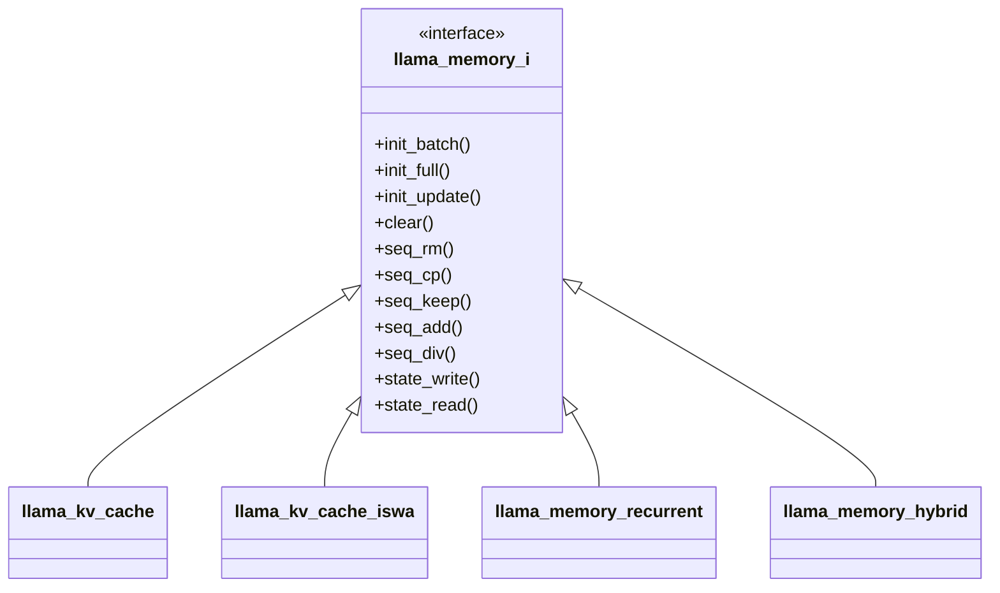
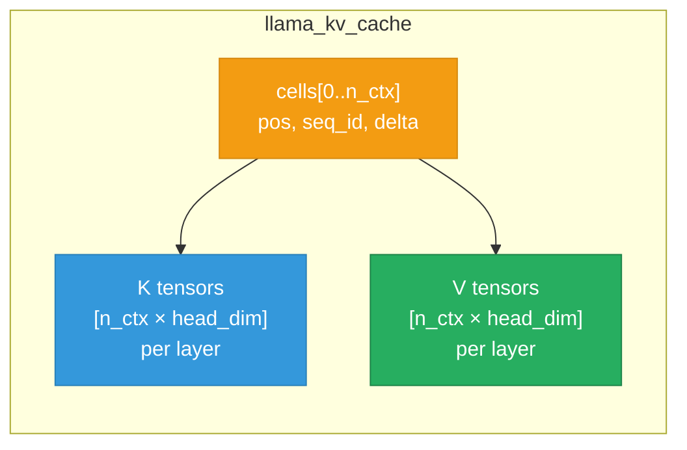
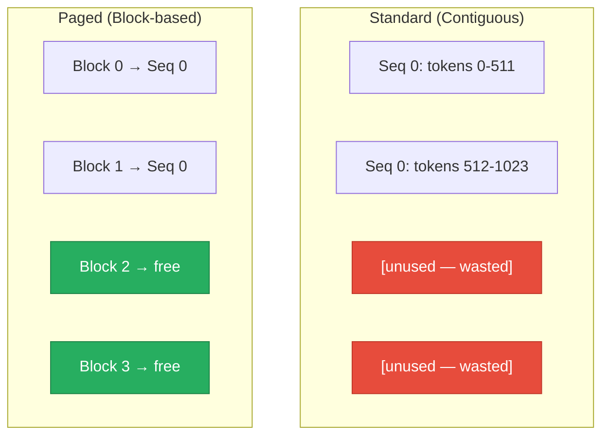

**Correction — September 13, 2026:** This describes an early wrapper experiment, not a completed PagedAttention implementation. The smoke test showed that text was returned, not that answers or inference state were correct. Memory-size examples and the distinction between free blocks and an allocated pool have been corrected. The later [dynamic-resize prototype and its correctness issues](/posts/dynamic-kv-cache-resize-llama-cpp/) are a separate stage of the investigation.

## How LLMs Use Memory During Inference

In a conventional full-attention decoder, each attention layer caches past tokens' **Key** and **Value** tensors so they do not need to be recomputed at every decode step. Hybrid linear-attention/recurrent layers use different state, so the full-KV formula should not be applied to every layer indiscriminately.

The size scales linearly with context length:

```
KV cache size = n_ctx × n_layers × 2 × (n_heads_kv × head_dim) × dtype_size
```

Here `n_layers` counts the full-attention layers being cached, K and V are assumed to have equal dimensions and dtype, and this is a single-sequence estimate. Parameter count alone does not determine KV size. For example, Qwen3.5-27B has 16 full-attention layers, 4 KV heads and head dimension 256: FP16 K/V require 64 KiB per token, or **512 MiB at 8,192 tokens**, excluding recurrent state. [Official configuration](https://huggingface.co/Qwen/Qwen3.5-27B/blob/main/config.json)

This is the fundamental tension: **static allocation is simple and fast, but wasteful.**

## llama.cpp's Memory Architecture

### The `llama_memory_i` Interface

`llama.cpp` doesn't hardcode a single KV cache implementation. In the version examined for this experiment, the model-memory strategies use a polymorphic interface:


```mermaid
classDiagram
    class llama_memory_i {
        <<interface>>
        +init_batch()
        +init_full()
        +init_update()
        +clear()
        +seq_rm()
        +seq_cp()
        +seq_keep()
        +seq_add()
        +seq_div()
        +state_write()
        +state_read()
    }

    llama_memory_i <|-- llama_kv_cache
    llama_memory_i <|-- llama_kv_cache_iswa
    llama_memory_i <|-- llama_memory_recurrent
    llama_memory_i <|-- llama_memory_hybrid
```

Each implementation handles a different model architecture:

| Class | Purpose | Pattern |
|-------|---------|---------|
| `llama_kv_cache` | Standard attention (GPT, LLaMA, Qwen) | Contiguous flat buffer |
| `llama_kv_cache_iswa` | Interleaved Sliding Window Attention | Composes 2 `llama_kv_cache` instances |
| `llama_memory_recurrent` | Recurrent models (Mamba, RWKV) | Recurrent state, rather than token-indexed full KV |
| `llama_memory_hybrid` | Hybrid models (Jamba, Granite) | Composes attention + recurrent |

The factory is in `llama_model::create_memory()` — it inspects the model architecture and instantiates the appropriate class.

### How the Standard KV Cache Works

`llama_kv_cache` is the workhorse (~2200 lines). Its core data structure:


```mermaid
graph LR
    subgraph "llama_kv_cache"
        CELLS["cells[0..n_ctx]<br/>pos, seq_id, delta"]
        K["K tensors<br/>[n_ctx × head_dim]<br/>per layer"]
        V["V tensors<br/>[n_ctx × head_dim]<br/>per layer"]
    end

    CELLS --> K
    CELLS --> V

    style CELLS fill:#f39c12,stroke:#d68910,color:#fff
    style K fill:#3498db,stroke:#2980b9,color:#fff
    style V fill:#27ae60,stroke:#1e8449,color:#fff
```

Key characteristics:

- **Pre-allocated**: The full `n_ctx` buffer is allocated at context creation
- **Contiguous**: All cells are stored in a single buffer per layer
- **Slot-based**: Tokens are assigned to cells using a slot allocator
- **Defragmentable**: Can compact fragmented cells via copy operations

The contiguous per-layer layout works with the existing attention kernels. Actual allocation and execution are split across layers, streams, and backends; the cache is not necessarily one process-wide buffer or one matrix multiplication.

### The Context Object Pattern

This is a subtle but critical design detail. When the model processes a batch, the KV cache creates a **context object**:

```cpp
// What llama_kv_cache::init_batch() returns
class llama_kv_cache_context : public llama_memory_context_i {
    const llama_kv_cache * kv;
    std::vector<slot_info> sinfos;
    std::vector<llama_ubatch> ubatches;
    // ...
};
```

This context object is then passed to the **graph builder**, which uses it to construct the computation graph:

```cpp
// Inside llama-graph.cpp
const auto * mctx = static_cast<const llama_kv_cache_context *>(params.mctx);
```

Note the `static_cast` — the graph builder assumes the exact type. This has important implications for anyone implementing a new memory strategy (more on this below).

## PagedAttention: The Concept

The idea comes from [vLLM](https://arxiv.org/abs/2309.06180): instead of one monolithic buffer, divide the KV cache into fixed-size **blocks** (pages).


```mermaid
graph TB
    subgraph "Standard (Contiguous)"
        C1["Seq 0: tokens 0-511"]
        C2["Seq 0: tokens 512-1023"]
        C3["[unused — wasted]"]
        C4["[unused — wasted]"]
    end

    subgraph "Paged (Block-based)"
        B1["Block 0 → Seq 0"]
        B2["Block 1 → Seq 0"]
        B3["Block 2 → free"]
        B4["Block 3 → free"]
    end

    style C3 fill:#e74c3c,stroke:#c0392b,color:#fff
    style C4 fill:#e74c3c,stroke:#c0392b,color:#fff
    style B3 fill:#27ae60,stroke:#1e8449,color:#fff
    style B4 fill:#27ae60,stroke:#1e8449,color:#fff
```

Benefits:

- **Reduced allocation waste** — block allocation limits external fragmentation; the last block of a sequence can still be partially unused
- **Copy-on-Write** — shared prefixes between sequences can share physical blocks
- **Demand-based block assignment** — requests acquire blocks as needed; allocating or growing the backing GPU pool is a separate policy

Trade-offs:

- **Non-contiguous memory** — requires scatter/gather for attention kernels
- **Block management overhead** — tracking block tables adds CPU work
- **Kernel complexity** — GPU kernels need to handle non-contiguous memory access

## Implementation: Composing the Existing Cache

For the first experiment, I composed the existing `llama_kv_cache` to explore metadata management. This alone does not implement block-addressed attention:

```cpp
class llama_kv_cache_paged : public llama_memory_i {
private:
    std::unique_ptr<llama_kv_cache> kv;  // inner pool
    uint32_t block_size;                  // tokens per block (default: 256)
    uint32_t n_blocks;                    // total blocks
    std::vector<bool> block_used;         // per-block tracking
};
```

The constructor aligns the requested cache size to block boundaries:

```cpp
const uint32_t kv_size_aligned =
    ((kv_size + block_size - 1) / block_size) * block_size;
n_blocks = kv_size_aligned / block_size;

kv = std::make_unique<llama_kv_cache>(
        model, type_k, type_v, v_trans, offload, unified,
        kv_size_aligned, n_seq_max, n_pad,
        n_swa, swa_type, filter, reuse);
```

All 15+ `llama_memory_i` interface methods delegate to the inner cache:

```cpp
bool llama_kv_cache_paged::seq_rm(llama_seq_id seq_id,
                                   llama_pos p0, llama_pos p1) {
    bool res = kv->seq_rm(seq_id, p0, p1);
    update_block_usage();
    return res;
}
```

### The `static_cast` Trap

My first implementation created a custom `llama_kv_cache_paged_context` class that wrapped the inner context. It compiled cleanly. It segfaulted on the first run.

The root cause was in `llama-graph.cpp`:

```cpp
const auto * mctx = static_cast<const llama_kv_cache_context *>(params.mctx);
```

`static_cast` does not check the dynamic type here. My wrapper object was not a `llama_kv_cache_context`; treating it as that type caused undefined behavior, observed as a segfault in the experiment.

The fix is straightforward: don't wrap the context. The paged cache returns the inner `llama_kv_cache`'s context directly:

```cpp
llama_memory_context_ptr llama_kv_cache_paged::init_batch(
        llama_batch_allocr & balloc,
        uint32_t n_ubatch, bool embd_all) {
    return kv->init_batch(balloc, n_ubatch, embd_all);
}
```

This works because the paged layer manages **block metadata** — it doesn't need to intercept graph building. A complete block-based implementation would also need attention reads to follow the block mapping. Indexed writes such as `ggml_set_rows` alone do not provide that behavior.

**Takeaway:** In a codebase that uses `static_cast` for polymorphic dispatch, your new types must either inherit from the expected type or delegate entirely. There's no room for duck typing.

## Smoke Test

I ran a basic functional test with **Qwen2.5-0.5B-Instruct Q4_K_M** on an Apple M4 Mac Mini to check that the execution path returned text:

```bash
# Standard
$ llama-cli -m qwen2.5-0.5b.gguf -p "What is 2+2? Answer in one word:"
# → "Addition" — returned text; not a correct answer

# Paged
$ llama-cli -m qwen2.5-0.5b.gguf -p "What is 2+2? Answer in one word:" --kv-paged
# → "Two." — returned text; not a correct answer
```

| Metric | Standard | Paged |
|--------|----------|-------|
| Context memory | 384 MiB | 384 MiB |
| Total GPU memory | 1145 MiB | 1145 MiB |
| Returned text without this crash | Yes | Yes |

**Memory usage is identical** — expected, since this phase pre-allocates the full pool.

I'm intentionally not reporting speed numbers here. The prompt was ~15 tokens, a single run, on a tiny model with 384 MiB of KV cache. At this scale, timing noise (warm cache effects, OS scheduling) dominates any real measurement. A meaningful performance comparison requires:

- A larger model (7B+) where KV cache is multiple GB
- Long prompts (1K+ tokens) to amortize startup costs
- Multiple runs to average out variance
- Multi-sequence scenarios where paging actually helps

The smoke test only showed that the execution path returned text. Neither quoted answer is a correct answer to 2+2, and this was not a baseline-equivalence or KV-state test. Correctness requires controlled state/logits comparisons; performance claims additionally need a working block-based implementation and repeated measurements.

## What's Next

This initial implementation establishes the **infrastructure** — block tracking, the `llama_memory_i` class, and the CLI flag (`--kv-paged`). The actual memory savings require:

1. **Block-addressed attention** — Implement a logical-to-physical block mapping and make both KV writes and attention reads respect it
2. **Dynamic pool growth** — Starting with a smaller pool and growing on demand
3. **Copy-on-Write** — Sharing physical blocks between sequences that share a common prefix

These were proposed follow-up tasks, not completed capabilities. Pool sharing and demand-based assignment can reduce waste within an allocated pool without returning that pool to the OS.

---

*The wrapper used an experimental `--kv-paged` flag. Its exact historical commit is not pinned here, so this is not a command guaranteed to work on the current fork. The later `--kv-dynamic` submission is linked in [Part 3](/posts/dynamic-kv-cache-resize-llama-cpp/).*
