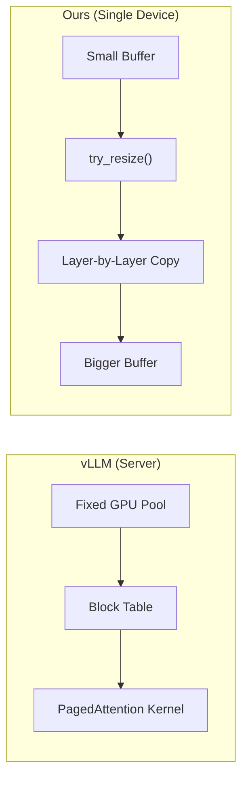

## The Problem: 8 GB of Memory for a 10-Token Conversation

In the [previous post](/posts/paged-attention-llama-cpp-deep-dive/), I built a paged KV cache wrapper for `llama.cpp`. It tracked blocks, managed metadata, and correctly dispatched to the inner `llama_kv_cache` — but memory usage was identical to vanilla.

Why? Because the wrapper still allocated the full buffer upfront, and blocks were internally contiguous. The metadata-only approach saved nothing.

To actually save memory, I needed to go deeper: **prevent physical memory from being committed for pages that aren't used yet.**

## The Hypothesis: Demand Paging Should Work

macOS uses demand paging for virtual memory. When you call `vm_allocate`, the OS reserves virtual address space but commits physical pages only on first access:

```
vm_allocate(4 GB)

Virtual:   [████████████████████████]  4 GB reserved (instant)
Physical:  [                        ]  0 bytes       (nothing committed)

First write → page fault:
  page[0]  → [█                       ]  16 KB committed
  page[3]  → [█  █                    ]  32 KB committed
```

Untouched pages consume zero physical RAM. This is how every modern OS manages memory.

I found that `llama.cpp`'s Metal backend uses exactly this mechanism:

```objc
// ggml-metal-device.m
kern_return_t err = vm_allocate(mach_task_self(), &data, size, VM_FLAGS_ANYWHERE);

res->buffers[0].metal = [device newBufferWithBytesNoCopy:data
                                                  length:size_aligned
                                                 options:MTLResourceStorageModeShared
                                             deallocator:nil];
```

Step 1 allocates virtual memory with demand paging. Step 2 wraps it as a Metal GPU buffer in shared mode (unified memory — CPU and GPU share the same physical RAM on Apple Silicon).

My plan was simple:

1. Skip the `buffer_clear(buf, 0)` call that touches every page
2. Let demand paging do its job — only pages written during inference get committed
3. Use `madvise(MADV_FREE_REUSABLE)` to release pages when sequences are deleted

**Zero code changes to the compute path. Zero kernel modifications. Just stop touching pages that don't need to be touched.**

## Testing with Small Models: It Works!

I implemented the plan and tested with Qwen2.5 (0.5B and 7B):

| Model | Context | Vanilla RSS | Paged RSS | Savings |
|-------|---------|-------------|-----------|---------|
| 0.5B  | 32K     | 37 MB       | 18 MB     | **52%** |
| 7B    | 32K     | 6.20 GB     | 4.45 GB   | **30% (1.8 GB)** |

Promising! The 7B model saved 1.8 GB of real memory. The key fix was ensuring `buffer_clear()` was skipped — it was zero-filling the entire KV cache and touching every virtual page, defeating demand paging entirely.

## Testing with 27B: It Doesn't Work

Then I tested with Qwen3.5-27B, a 27B hybrid model with 64K context:

```
Vanilla RSS: 19.8 GB
Paged RSS:   19.9 GB
Savings:     0%
```

**Zero savings.** Not even a single megabyte.

The problem wasn't demand paging itself. There were two issues:

1. **Qwen3.5 is a hybrid architecture** — 3/4 of its layers are recurrent (SSM), not attention. Our paged wrapper only covered `llama_kv_cache`, which handles the attention layers. The SSM state memory was untouched.

2. **And the deeper issue...** even for the attention layers, `newBufferWithBytesNoCopy` was defeating demand paging entirely.

## The Discovery: Metal Commits All Physical Pages

Through deeper testing and analysis, I discovered that `newBufferWithBytesNoCopy` commits **all** physical pages at buffer creation time, regardless of whether they've been touched:

```
Step 1 (vm_allocate):
  Virtual:  [████████████████]  4 GB
  Physical: [                ]  0 bytes  ← demand paging active

Step 2 (newBufferWithBytesNoCopy):
  Virtual:  [████████████████]  4 GB
  Physical: [████████████████]  4 GB     ← ALL pages committed!
```

The name "NoCopy" is misleading. It means "don't copy the data" (use existing memory), not "don't commit the pages." When Metal creates a GPU buffer, it must register every virtual-to-physical page mapping in the **GPU MMU** — and unlike the CPU, the GPU has no page fault handler.

### Why GPUs Can't Do Demand Paging

```
CPU access pattern:
  page fault → kernel trap → allocate physical page → resume
  (transparent, the program never knows)

GPU access pattern:
  page fault → ??? → GPU hang / crash
  (no page fault handler exists on the GPU)
```

The CPU kernel can intercept page faults and lazily allocate physical memory. The GPU cannot. Therefore, Metal must ensure **every page is physically backed** before any GPU kernel could potentially access it. Even on Apple Silicon's unified memory (same physical RAM for CPU and GPU), the GPU MMU operates differently from the CPU MMU.

### Everything I Tried (and Failed)

| Attempt | Result | Why |
|---------|--------|-----|
| Skip `buffer_clear` | ❌ | `newBufferWithBytesNoCopy` already committed all pages |
| `madvise(MADV_FREE_REUSABLE)` | ❌ | Metal holds references, OS can't reclaim |
| MTL Residency Sets (lazy) | ❌ | Controls residency, not page commitment |
| Don't touch the buffer at all | ❌ | Pages committed at `MTLBuffer` creation |

## The Pivot: If You Can't Make Big Buffers Lazy, Make Small Buffers

The realization was stark: **no OS-level trick can save memory for Metal GPU buffers.** The only way to use less memory is to allocate less memory.

```
Vanilla:    MTLBuffer(4 GB) → 4 GB physical RAM committed    💀
Dynamic:    MTLBuffer(16 MB) → 16 MB physical RAM committed  ✅
            → full? → MTLBuffer(32 MB) → copy → swap
            → full? → MTLBuffer(64 MB) → copy → swap
            → ...grow on demand
```

Instead of one big buffer with OS-level laziness (which doesn't work on GPU), allocate a **small contiguous buffer** and grow it when needed. This is entirely application-level — no OS magic, no kernel modifications, no custom Metal shaders.

## The Design Difference: vLLM vs Our Approach

This is fundamentally different from how vLLM solves the same problem:



| Aspect | vLLM | Dynamic Resize |
|--------|------|----------------|
| Memory savings from | Pool sharing across requests | Minimal initial allocation |
| Kernel changes | Custom PagedAttention kernel | **None** (standard ggml) |
| Memory layout | Non-contiguous (block table) | **Contiguous** (Metal-optimal) |
| Resize cost | None (pool internal) | Layer-by-layer copy (~45ms) |
| Implementation | Very complex (~1000s LOC) | **Simple** (~200 LOC) |
| Best for | Servers (many concurrent requests) | **Personal devices** (single user) |

vLLM's approach requires custom GPU kernels that handle non-contiguous memory access via block tables. On Metal, writing custom GPU kernels is impractical — Apple's Metal Shading Language ecosystem doesn't have the same level of community tooling as CUDA. Our approach works *with* Metal's contiguous memory model instead of *against* it.

## What's Next

The next post covers the implementation: `try_resize()`, the doubling-to-linear growth strategy, and benchmark results showing **8.3 GB memory savings** on a 27B model with zero GPU OOM crashes.

---

*This is part 2 of a 3-part series on KV cache optimization in llama.cpp. [Part 1](/posts/paged-attention-llama-cpp-deep-dive/) covers the initial PagedAttention implementation. Part 3 covers the Dynamic Resize implementation and benchmarks.*
