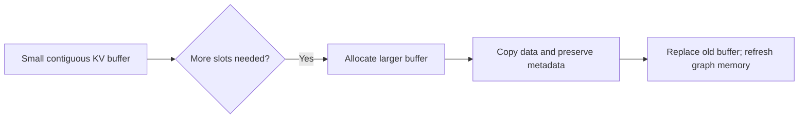

**Correction — September 13, 2026:** The original post generalized a local result into the claim that GPUs cannot handle page faults and that all Metal buffers always commit every physical page at creation. The evidence presented here does not establish that. This revision separates the historical observations from the explanation, and removes the illustration that made the same unsupported generalization.

## The Problem: A Full KV Pool for a Short Conversation

In the [previous post](/posts/paged-attention-llama-cpp-deep-dive/), I built a paged KV cache wrapper for `llama.cpp`. It tracked blocks and delegated to the existing `llama_kv_cache`, but the full backing pool was still allocated upfront. Tracking free blocks alone did not reduce that allocation.

My next question was whether I could keep a large virtual allocation while delaying physical backing for unused pages. This is a different question from distributing an already allocated pool among requests.

## The Hypothesis: Avoid Touching Unused Pages

CPU virtual-memory allocation can separate reserving an address range from physically backing its pages. The exact behavior depends on the allocation mechanism and subsequent accesses; virtual allocation size is not a measurement of resident memory.

The Metal backend path I investigated used `vm_allocate` followed by `newBufferWithBytesNoCopy`:

```objc
// Excerpt from the backend path investigated at the time.
kern_return_t err = vm_allocate(mach_task_self(), &data, size, VM_FLAGS_ANYWHERE);

res->buffers[0].metal = [device newBufferWithBytesNoCopy:data
                                                  length:size_aligned
                                                 options:MTLResourceStorageModeShared
                                             deallocator:nil];
```

The second call exposes existing memory as a shared Metal buffer. “NoCopy” concerns reusing the data storage; the name does not promise lazy physical commitment. Unified CPU/GPU memory also does not, by itself, specify identical paging behavior for every resource and access path.

The experiment tried skipping `ggml_backend_buffer_clear(buf, 0)` and using `madvise(MADV_FREE_REUSABLE)` when sequences were removed. The idea was to avoid writes to unused regions and allow reclaiming memory. Skipping initialization also needs an independent correctness check: the existing clear protects against uninitialized padding, including NaNs affecting computation.

## Historical RSS Observations

The original notes reported these values for small Qwen2.5 models:

| Model | Context | Vanilla RSS | Experimental RSS | Recorded difference |
|-------|---------|-------------|------------------|---------------------|
| 0.5B | 32K | 37 MB | 18 MB | 52% lower |
| 7B | 32K | 6.20 GB | 4.45 GB | About 1.8 GB lower |

Those are the original RSS labels and observations. The full allocation trace, offload configuration, and measurement timing have not been recovered for this correction. In particular, the very small 0.5B RSS values should not be presented as an audited total CPU-plus-GPU model footprint. A lower RSS alone does not demonstrate GPU demand paging or identify which buffers account for the difference.

For Qwen3.5-27B at 64K context, the notes instead reported:

```text
Vanilla RSS:      19.8 GB
Experimental RSS: 19.9 GB
```

The expected reduction was absent in that setup. There was also a separate integration problem: the initial wrapper covered the standalone `llama_kv_cache` path, while Qwen3.5 used `llama_memory_hybrid`. The attention options needed to reach the cache inside that hybrid path.

Qwen3.5-27B has **64 text layers: 16 full-attention and 48 Gated DeltaNet linear-attention layers**, not 16 attention plus 64 recurrent layers. The recurrent state and the full-attention KV cache are separate memory components. [Official model description](https://huggingface.co/Qwen/Qwen3.5-27B#model-overview)

## What the Experiments Did Not Establish

The original explanation attributed the larger-model result to eager physical commitment at `newBufferWithBytesNoCopy`. That was an interpretation of the local investigation. Without a controlled allocation-only reproduction and resource-residency measurements, this post cannot establish the exact commitment point or extend it to every Metal device and OS version.

The statement “GPUs have no page-fault handler” was incorrect as a general claim. NVIDIA documents GPU page faults and on-demand migration for CUDA Unified Memory on supported hardware. That does not prove equivalent behavior for the Metal buffer path above; it shows why the platforms must be distinguished. [NVIDIA: Maximizing Unified Memory Performance in CUDA](https://developer.nvidia.com/blog/maximizing-unified-memory-performance-cuda/)

The original notes also reported no useful saving from skipping the clear, applying `MADV_FREE_REUSABLE`, trying residency sets, or leaving the buffer untouched in the larger-model investigation. Those outcomes do not individually prove that Metal always prevents reclamation. Residency, virtual mappings, physical backing, and process RSS require separate measurements.

The narrower conclusion is sufficient for the next design step: **the approach tested here did not deliver the intended saving for the larger-model setup**. Smaller-model RSS changes and larger-model failures need their code paths and measurement conditions reconciled before assigning a single mechanism to both.

## The Pivot: Grow the Application's Buffer

I moved to a design that directly changes the allocated KV buffer size:


```mermaid
flowchart LR
    A["Small contiguous KV buffer"] --> B{"More slots needed?"}
    B -->|Yes| C["Allocate larger buffer"]
    C --> D["Copy data and preserve metadata"]
    D --> E["Replace old buffer; refresh graph memory"]
```

This avoids relying on a large untouched buffer having a small physical footprint. It introduces different costs: old and new buffers coexist during copying, state and tensor layouts must be preserved, and growth may fail when memory is exhausted.

The [dynamic-resize post](/posts/dynamic-kv-cache-resize-llama-cpp/) records the initial-allocation result and the limitations found in the submitted prototype. Its September correction includes a reproduced metadata-reset bug and a transposed-V copy-layout issue. It should not be read as a production-ready solution or a general OOM cure.

## PagedAttention and Dynamic Resize Address Different Layers

| Aspect | Block-based PagedAttention | This dynamic-resize prototype |
|--------|---------------------------|-------------------------------|
| Main change | Map logical token blocks to physical KV blocks | Increase the capacity of contiguous KV tensors |
| Sharing | Can share blocks for common prefixes | Uses the existing cache's sharing behavior |
| Initial process allocation | Depends on how the backing pool is provisioned | Starts with a smaller backing buffer |
| Attention path | Must understand the block mapping | Keeps the existing ggml attention path |
| Growth cost | Depends on pool policy | Allocate, initialize, copy, and refresh graph memory |
| Main validation concern | Block mapping, sharing, and kernel correctness | State preservation, layouts, transient peak, and failures |

A PagedAttention pool can be reserved upfront. Free blocks inside it do not necessarily reduce the process's allocated GPU memory. Conversely, dynamic contiguous growth does not implement PagedAttention. [PagedAttention paper](https://arxiv.org/abs/2309.06180)

I chose to keep the existing attention path to limit the implementation scope. This was an engineering choice for the prototype, not evidence that writing a Metal paged-attention kernel is impossible or impractical in general. The earlier approximately 45 ms copy-cost comparison has been removed because it is not a verified measurement for the submitted implementation.

---

*Part 2 of a three-part KV cache investigation. [Part 1](/posts/paged-attention-llama-cpp-deep-dive/) covers the wrapper experiment; [Part 3](/posts/dynamic-kv-cache-resize-llama-cpp/) covers dynamic growth, historical measurements, and the later correctness review.*
