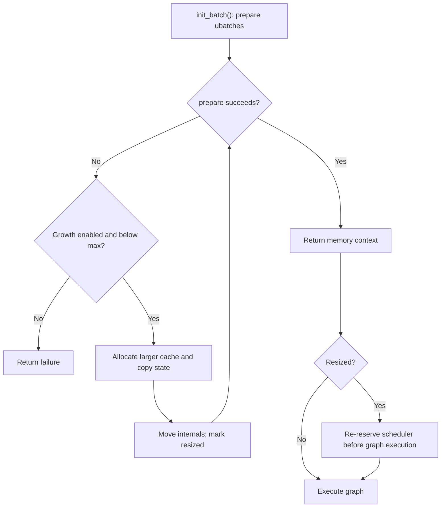

## From 8 GB Upfront to 16 MB on Demand

In the [previous post](/posts/demand-paging-fails-apple-silicon-gpu/), attempts to reduce memory usage through lazy page commitment did not give the intended savings in my larger-model Metal setup. I switched to allocating smaller KV buffers and growing them at the application level.

**Correction — September 13, 2026:** This post combines early local measurements with a later implementation submitted as [PR #21757](https://github.com/ggml-org/llama.cpp/pull/21757). The PR remains open and unmerged as of this update. A review of the submitted commit found a metadata-preservation bug during resize, reproduced below, and a transposed-V copy-layout issue. Initial allocation savings, successful process completion, and correct inference after growth are separate claims. The historical benchmark tables do not validate the final submitted code.

The implementation discussion below is pinned to commit [`1e79a792`](https://github.com/ggml-org/llama.cpp/commit/1e79a792e03b48a205e80b5eadeffabd09f6af14). This is a grow-only prototype, with no shrink, memory-budget enforcement, or runtime KV offloading.

## How It Works

The idea is straightforward:

1. **Start small** — allocate 256 cells per KV stream instead of the full configured size
2. **Grow on demand** — when `init_batch()` fails because the cache is full, call `try_resize()` to allocate a bigger cache, copy existing data, and retry
3. **Re-reserve the scheduler** — after `init_batch()` triggers a resize, `llama_context` notices the resize flag and re-reserves compute buffers before graph execution



This diagram describes the intended successful path. Allocation may fail, and the submitted state-copy path has correctness defects described below. The `--kv-dynamic` flag is opt-in; the default allocation policy remains unchanged.

### The try_resize() Implementation

The intended resize is a create-copy-move pattern. This schematic omits error handling and final metadata resizing; it is not a corrected implementation:

```cpp
bool llama_kv_cache::try_resize() {
    // calculate new size with growth strategy
    uint32_t new_size = calculate_growth(kv_size_cur);

    // create a temporary cache with the new size;
    // kv_size_max=0 disables the "start at 256" logic for the temp cache
    llama_kv_cache tmp(model, saved_type_k, saved_type_v, ...
                       new_size, ... /* kv_size_max = */ 0);

    // copy existing data layer by layer
    tmp.copy_from(*this);

    // steal the internals
    ctxs_bufs = std::move(tmp.ctxs_bufs);
    layers    = std::move(tmp.layers);
    v_cells   = std::move(tmp.v_cells);
    v_heads   = std::move(tmp.v_heads);
}
```

The move assignments transfer ownership of the new buffers into the existing cache object; old destination resources are released as they are replaced. This is not a zero-copy resize: tensor contents have already been copied through staging buffers. Preserving all existing inference state was the intent, but the submitted metadata and transposed-V paths do not meet that requirement.

### Layer-by-Layer, Stream-by-Stream Copy

The `copy_from()` method copies tensor data through a CPU staging buffer one layer at a time, and one stream view at a time:

```cpp
void llama_kv_cache::copy_from(const llama_kv_cache & other) {
    for (size_t il = 0; il < layers.size(); ++il) {
        for (size_t s = 0; s < other.layers[il].k_stream.size(); ++s) {
            std::vector<uint8_t> staging(ggml_nbytes(other.layers[il].k_stream[s]));
            ggml_backend_tensor_get(other.layers[il].k_stream[s], staging.data(), 0, staging.size());
            ggml_backend_tensor_set(layers[il].k_stream[s], staging.data(), 0, staging.size());
        }

        // same pattern for V stream views
    }
}
```

This limits the **CPU staging allocation** to one layer/stream view at a time. It does not eliminate the simultaneous old and new KV allocations:

```text
resize footprint ≈ old KV + new KV + one staging view
                   + model weights + recurrent state + compute/runtime buffers
```

Growing KV from 4 GiB to 5 GiB temporarily needs about 9 GiB for the two KV backing stores alone. The new cache is also zero-filled before copying. Per-stream copying is needed because each stream's offset changes when its capacity grows. The transposed-V layout needs an additional stride-aware copy, which this implementation lacks.

The current version also keeps KV buffers zero-initialized. The memory savings come from starting with a much smaller cache, not from leaving padding or future rows uninitialized.

## Growth Strategy: The 4→8 GB Jump Problem

My first implementation used simple doubling: 256 → 512 → 1K → 2K → ... → 64K → 128K.

The problem is what happens at large sizes:

```
Doubling:   ... → 32K (2 GB) → 64K (4 GB) → 128K (8 GB) → 💥 GPU OOM
                                              ↑
                                         4 GB jump!
```

On my 32 GB machine, model weights and the rest of the system left limited headroom. A 4→8 GiB KV jump could exceed it, especially while both buffers existed. Available headroom depends on other processes and compute allocations; it is not a fixed property of every 32 GB system.

The submitted approach uses doubling for small caches and approximately 1 GiB increments afterward. It reduces the size of large growth steps, but cannot guarantee that an allocation will fit.

The current implementation uses a simple heuristic:

```cpp
if (kv_size_cur < 4096) {
    new_size = kv_size_cur * 2;
} else {
    const size_t total = total_size();
    const size_t per_cell = total / kv_size_cur;
    const uint32_t cells_per_gb =
        per_cell > 0 ? (uint32_t) (1024ULL * 1024 * 1024 / per_cell) : kv_size_cur;
    new_size = kv_size_cur + std::max(cells_per_gb, 256u);
}
```

The switch point is a fixed `4096` cells, not a measured optimum. The increment uses the cache's total footprint, including its streams. With one stream and 64 KiB per cell, the submitted rule gives approximately:

```text
Cells:  256 → 512 → 1024 → 2048 → 4096 → 20480 → 36864 → ...
KV:    16MiB 32MiB  64MiB 128MiB 256MiB 1.25GiB 2.25GiB
```

This differs from the 8,192- and 32,768-cell stages in the historical table below. The [April 11 post update](https://github.com/rockyRunnr/rockyRunnr.github.io/commit/a8bbe7b751) changed the implementation discussion while retaining those earlier measurements. They must not be treated as results from the pinned PR commit.

## The Hybrid Model Gotcha

Qwen3.5-27B has **64 text layers in total: 16 full-attention layers and 48 linear-attention layers using Gated DeltaNet**, according to its [official model description](https://huggingface.co/Qwen/Qwen3.5-27B#model-overview). My earlier count of 16 attention plus 64 recurrent layers was incorrect. In this llama.cpp path, `llama_memory_hybrid` combines a `llama_kv_cache` for full attention with `llama_memory_recurrent` for recurrent state. This patch grows the attention KV component.

For a single stream with FP16 K and V, the [model configuration](https://huggingface.co/Qwen/Qwen3.5-27B/blob/main/config.json) explains the attention-KV allocation:

```text
16 layers × 4 KV heads × 256 dimensions × 2 (K and V) × 2 bytes
= 64 KiB per cell
131,072 cells = 8 GiB; 256 cells = 16 MiB
```

`Q4_K_M` describes weight quantization; it does not mean the KV cache is 4-bit. These figures exclude recurrent state and compute buffers.

My initial implementation only added dynamic resize to the standalone `llama_kv_cache` path. Hybrid models take a different code path through `llama_memory_hybrid`, so the dynamic parameters weren't forwarded:

```cpp
// Before: hybrid path didn't forward kv_dynamic
res = new llama_memory_hybrid(model, type_k, type_v, ...
                              offload, unified,
                              filter_attn, filter_recr);

// After: forward kv_size_max into the attention KV cache path
res = new llama_memory_hybrid(model, type_k, type_v, ...
                              offload, unified,
                              filter_attn, filter_recr,
                              cparams.kv_dynamic ? cparams.n_ctx_seq : 0);
```

The hybrid model's `init_batch()` also needed its own retry logic:

```cpp
auto heads_attn = mem_attn->prepare(ubatches);
while (heads_attn.empty()) {
    if (!mem_attn->try_resize()) {
        break;
    }
    heads_attn = mem_attn->prepare(ubatches);
}
```

## Historical Local Measurements

These are the previously published local measurements, not a new benchmark run. The exact benchmark binary, commit, and complete raw logs have not been recovered for this correction. The tables retain the original MB labels; attention-KV sizes correspond to MiB, while the RSS unit conversion cannot be independently confirmed from the table alone. Completion and OOM counts are observations across the listed configurations, not a statistically estimated failure rate.

Hardware: **Apple M4 Mac Mini, 32 GB unified memory**  
Model: **Qwen3.5-27B Q4_K_M** (hybrid architecture)  
Context: **131,072 tokens** (`-c 131072`)

### Vanilla (8 GB KV cache allocated upfront)

| Prompt Tokens | Gen t/s | RSS (MB) | KV (MB) | Status |
|:---:|:---:|:---:|:---:|:---:|
| 89 | 4.34 | 24,474 | 8,192 | Completed |
| 809 | — | 10,765 | 8,192 | ❌ GPU OOM |
| 6,409 | — | 24,421 | 8,192 | ❌ GPU OOM |
| 25,609 | — | 24,458 | 8,192 | ❌ GPU OOM |
| 40,009 | — | 24,447 | 8,192 | ❌ GPU OOM |

The record reports GPU OOM errors (`kIOGPUCommandBufferCallbackErrorOutOfMemory`) for four of the five listed vanilla configurations. Those errors do not by themselves establish a general rule about Metal paging or identify which allocations exhausted available resources.

### Dynamic (start at 256 cells, grow on demand)

| Prompt Tokens | Gen t/s | RSS (MB) | KV (MB) | KV Cells | Resizes | GPU OOM |
|:---:|:---:|:---:|:---:|:---:|:---:|:---:|
| 89 | **4.66** | 16,145 | 16 | 256 | 0 | 0 |
| 809 | **4.66** | 16,197 | 64 | 1,024 | 2 | 0 |
| 6,409 | **4.47** | 16,464 | 512 | 8,192 | 5 | 0 |
| 25,609 | **3.78** | 17,322 | 2,048 | 32,768 | 7 | 0 |
| 40,009 | **3.27** | 18,413 | 3,072 | 49,152 | 8 | 0 |
| 64,009 | **2.65** | 19,514 | 4,096 | 65,536 | 9 | 0 |
| 80,009 | **2.32** | 19,002 | 5,120 | 81,920 | 10 | 0 |

The record reports completion without GPU OOM for all seven dynamic configurations, and no swap up to 64K tokens. It does not establish baseline-equivalent output, preserved context across resize, or a general absence of future OOM.

### What the Measurements Support

The 89-token row used 256 cells and recorded **zero resizes**. Its RSS fell from 24,474 to 16,145 in the original table units, about 34%; attention-KV allocation fell from 8 GiB to 16 MiB. This supports the initial-allocation result. It does not exercise the metadata-loss bug during growth.

The longer runs remain historical observations. Their exact implementation version and inference correctness need verification before using them to claim usable long-context capacity or low resize overhead.

Longer context can increase decode cost, but it is inaccurate to explain a single cached decode step as O(T²) attention. For fixed head dimensions, a new query attends over T cached keys and values, so that step's full-attention work grows roughly with T. Full-attention prefill across T tokens has a quadratic term. These measurements do not isolate resize cost from that context-length effect. [KV cache mechanics](https://huggingface.co/docs/transformers/main/en/cache_explanation)

## Correctness Issues in the Submitted Commit

### Metadata is reset after being copied

`try_resize()` copies `v_cells` and then calls `v_cells[s].resize(new_size)`. The existing [`llama_kv_cells::resize()`](https://github.com/ggml-org/llama.cpp/blob/1e79a792e03b48a205e80b5eadeffabd09f6af14/src/llama-kv-cells.h#L63) resizes its vectors and calls `reset()`. That clears all token positions, sequence memberships, and the used-cell set, including the entries just copied.

A minimal C++17 test using the unmodified headers from the submitted commit reproduces this:

```text
Set position 42 and sequence 0 in cell 0; copy; grow from 256 to 512.
before: size=256 used=1 empty0=0 seq0=1
after: size=512 used=0 empty0=1 seq0=0
```

The reproduction establishes metadata loss when prior tokens exist. It does not rerun the 27B model or establish which earlier benchmark binaries had the same defect. Growing an empty cache before its first batch does not exercise preservation of prior tokens.

Download the [C++ test](/assets/code/kv-cache/check_metadata.cpp) and [reproduction script](/assets/code/kv-cache/reproduce_metadata_reset.py) into the same directory, then run `python3 reproduce_metadata_reset.py`. It downloads headers at the pinned commit into a temporary directory and invokes a C++17 compiler. It does not run a model.

A fix needs to preserve existing cell state and initialize only the added range, followed by state and logits comparisons across resize boundaries. The submitted PR has not been fixed by this documentation update.

### Transposed V needs a layout-aware copy

When `v_trans` is true, [`get_v()`](https://github.com/ggml-org/llama.cpp/blob/1e79a792e03b48a205e80b5eadeffabd09f6af14/src/llama-kv-cache.cpp#L1283) uses cache capacity in its strides. Copying the old V view's bytes into the start of a larger view does not move each feature to its new offset:

```text
Old, capacity 2:     [a0 a1 | b0 b1]
Needed, capacity 4:  [a0 a1 0 0 | b0 b1 0 0]
Raw prefix copy:    [a0 a1 b0 b1 | 0 0 0 0]
```

This finding follows from the copy code and layout; it has not been reproduced with a full Flash-Attention-disabled model run here. Verification needs both V layouts, populated-cache growth, multiple streams, and hybrid models.

### PR scope and discussion

[PR #21757](https://github.com/ggml-org/llama.cpp/pull/21757) proposes an opt-in tradeoff: a large configured upper bound with lower initial allocation. Review discussion raised late OOM and the value of deterministic preallocation. `--kv-unified` shares capacity across sequences; dynamic growth changes when capacity is allocated. The PR supports cache-wide growth in the standard and hybrid paths it modifies, not independent per-sequence growth or every memory strategy.

Bounded growth, shrink, model reloading, GPU repartitioning, and KV migration were discussed as follow-up directions, not implemented features. The correctness findings above are from this later examination, not documented reasons for the PR remaining unmerged.

## Submitted Code

The current implementation is **215 insertions and 7 deletions** across 11 files:

```
 common/arg.cpp              |   7 +++
 common/common.cpp           |   1 +
 common/common.h             |   1 +
 include/llama.h             |   1 +
 src/llama-context.cpp       |  29 ++++++++++
 src/llama-cparams.h         |   1 +
 src/llama-kv-cache.cpp      | 133 +++++++++++++++++++++++++++++++++++++++++++-
 src/llama-kv-cache.h        |  26 ++++++++-
 src/llama-memory-hybrid.cpp |  13 ++++-
 src/llama-memory-hybrid.h   |   4 +-
 src/llama-model.cpp         |   6 +-
 11 files changed, 215 insertions(+), 7 deletions(-)
```

No custom GPU kernels. No new wrapper classes. No ggml modifications. Just growth logic inside the existing `llama_kv_cache` class, triggered automatically when the cache is full and `--kv-dynamic` is enabled.

## Inspect the Historical Prototype

```bash
git clone https://github.com/rockyRunnr/llama.cpp
cd llama.cpp && git checkout 1e79a792e03b48a205e80b5eadeffabd09f6af14
cmake -B build -DGGML_METAL=ON && cmake --build build -j

./build/bin/llama-completion \
    -m your-model.gguf \
    -c 131072 \
    --kv-dynamic \
    -p "Your prompt here" -n 100
```

These commands inspect the historical prototype with the known issues above. A log showing a resize is not proof of preserved context. Watch for `dynamic KV cache: start = 256 cells` and `resizing KV cache from X to Y cells`, then validate state and outputs against a fixed-capacity baseline before drawing performance conclusions.

---

*This is part 3 of a 3-part series on KV cache optimization in llama.cpp. [Part 1](/posts/paged-attention-llama-cpp-deep-dive/) covers the initial architecture analysis. [Part 2](/posts/demand-paging-fails-apple-silicon-gpu/) covers the demand paging investigation and Metal experiments.*
